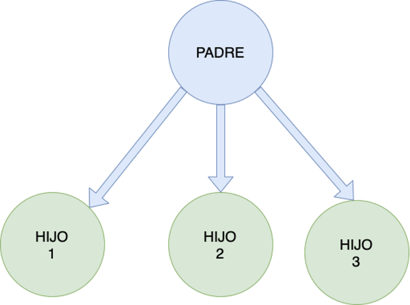
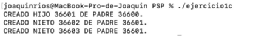
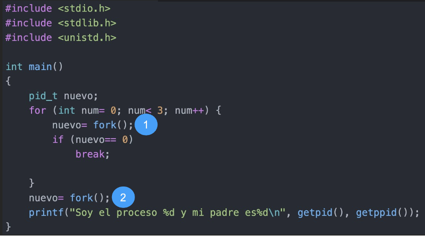
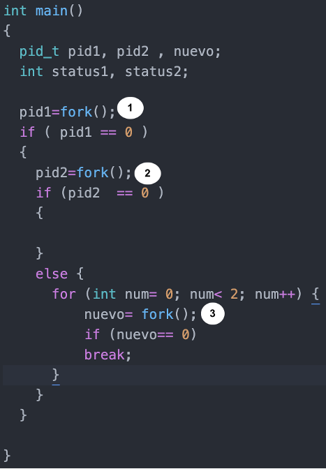
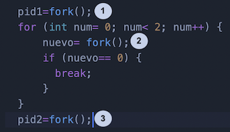

A)	Crear un programa en C que genere la siguiente estructura de procesos: 

El resultado mostrado por pantalla debe ser el siguiente: 

[SOLUCIÓN 1](_resources/ejercicio_a1.c)

[SOLUCIÓN 2](_resources/ejercicio_a2.c)

[SOLUCIÓN 3](_resources/ejercicio_a3.c) 
 
B)	Crear un programa en C que genere la siguiente estructura de procesos: 

El resultado mostrado por pantalla debe ser el siguiente: 

[SOLUCIÓN](_resources/ejercicio_b.c)

C) Dibuja el árbol de procesos generado por el código a continuación indicando el fork que lo genera:

[SOLUCIÓN](_resources/ejercicio_c.png)

D) Dibuja el árbol de procesos generado por el código a continuación indicando el fork que lo genera:
 

E) Dibuja el árbol de procesos generado por el código a continuación indicando el fork que lo genera:

F) Dibuja el árbol de procesos generado por el código a continuación indicando el fork que lo genera:

G)	Dibuja el árbol de procesos generado por el código siguiente indicando el fork que lo genera:

G)	Dibuja el árbol de procesos generado por el código siguiente indicando el fork que lo genera:
