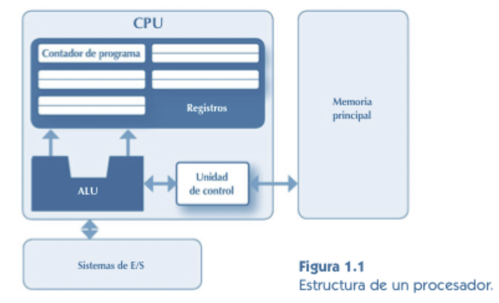
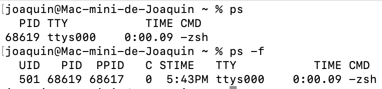
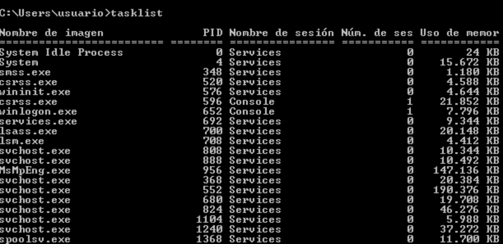
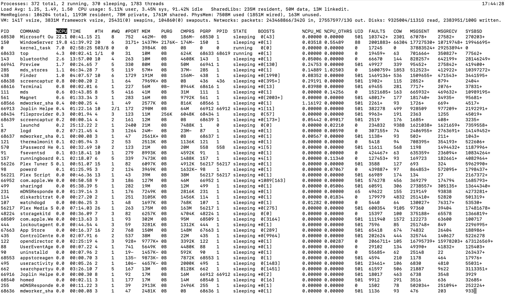
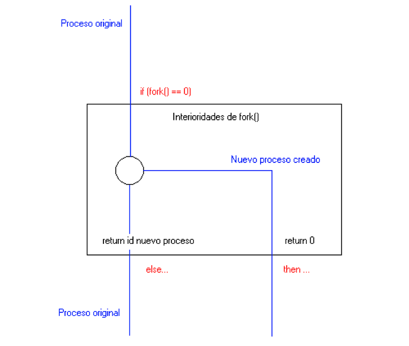

### - [Ejecutables. Procesos. Servicios.](#uno)
### - [Estados de un proceso.](#dos)
### - [Cambios de estado.](#tres)
### - [Planificación de procesos por el sistema operativo.](#cuatro)
### - [Hilos. Concepto y características. Hilos frente a procesos.](#cinco)
### - [Programación concurrente.](#seis)
### - [Programación paralela y distribuida.](#siete)
### - [Gestión de procesos.](#ocho)
### - [Creación, ejecución y finalización de procesos.](#nueve)
### - [Comunicación entre procesos.](#diez)
### - [Sincronización entre procesos.](#once)
### - [Mecanismos de comunicación y sincronización.](#doce)
### - [Programación de aplicaciones multiproceso.](#trece)


<a name="uno"></a>
## Ejecutables. Procesos. Servicios. 

### Introducción
Los  potencia de cálculo de los dispositivos electrónicos domésticos (PCs, tablets, teléfonos móviles , …) la proporciona el procesador.  Es el elemento fundamental, junto con la memoria principal. Cuando se estudia la estructura básica de un edispositivo electrónico, el procesador (también llamado CPU) es un elemento indispensable.



En la actualidad, se requiere una gran potencia de cálculo para procesar la ingente cantidad de información que disponemos. Podemos obtener mejores resultados y más rápidamente si utilizamos varios procesadores para realizar ese procesamiento y tratamiento de información. Cuando un equipo es capaz de hacer esto,  lo denominamos multiproceso. El uso del multiproceso  requiere de un trabajo extra, pues puede provocar situaciones de error que hay que evitar.

Un sistema **monoprocesador** es el que está formado únicamente por un solo procesador. 
Un sistema **multiprocesador**, en cambio, está formado por varios procesadores.


Sistema multiprocesador

En la actualidad, los equipos multicore están desplazando a los multiprocesadores pues son mucho más baratos y la eficiencia es ligeramente superior para los equipos multiprocesador, pero no compensa el desembolso extra.

Una implementación todavía más potente son las "granjas de procesamiento" o render farms, donde multitud de equipos trabajan en paralelo para aumentar la potencia de cálculo.


### Definiciones
Un **programa** es un conjunto de instrucciones escrita en un lenguaje de programación concreto. Una vez terminado, el programa se debe traducir a un lenguaje que el equipo donde se va a ejecutar entienda.
Un programa ejecutable (o **ejecutable** simplemente) contiene un conjunto de instrucciones que se pueden ejecutar directamente en una máquina. Esta puede ser una máquina fisica o, en el caso del lenguaje Java, una máquina virtual . Un programa es un objeto estático , normalmente almacenado en un fichero binario en un medio de almacenamiento secundario, como , por ejemplo , un disco duro. Es, por tanto, un elemento estático. 

En cambio, un **proceso** es dinámico, es una instancia de un programa en ejecución, que realiza los cambios indicados por el programa a los datos iniciales y obtiene una salida concreta. El proceso, además de las instrucciones, requerirá también de recursos específicos para la ejecución como el contador de instrucciones del programa, el contenido de los registros o los datos.

El sistema operativo es el encargado de la gestión de procesos: los crea, los elimina y provee las herramientas necesarias para la comunicación entre ellos. Cuando un proceso se está ejecutando se encuentra completamente en memoria y tiene asignados los recursos que necesita para su ejecución. Un proceso no puede escribir en zonas de memoria asignada a otros procesos ya que la memoria no es compartida.

Para obtener información sobre los procesos que se ejecutan en un sistema operativo, podemos hacer uso de diversas órdenes. En el caso de Linux/UNIX podemos utilizar las siguientes:

`ps` -  muestra por defecto el proceso actual. Si queremos información del proceso padre, podemos poner el modificador `-f`



Si queremos ver todos los procesos en ejecución, hay que poner el modificador -A


Los **servicios** son tareas automatizadas por el sistema operativo que se ejecutan en segundo plano y de manera transparente para el usuario. Los distintos sistemas operativos tienen distintas formas de gestionarlos.

Por ejemplo en windows, podemos comprobar los procesos y servicios en ejecución desde el administrador de tareas:

Para ello, iremos al Administrador de Tareas -> pestaña Procesos


También se puede mostrar en la línea de comandos mediante la orden `tasklist`, con laque podremos ver además el **PID**, el identificador del proceso.



Otro comando muy interesante es `top`, que muestra en tiempo real los procesos en ejecución, la memoria usada, asi como el estado de cada uno.


<a name="dos"></a>
## Estados de un proceso. 

Una vez que se ha creado un proceso, éste puede pasar por diversos estados y cambiar de uno a otro . El sistema operativo gestiona los cambios de estado como ya hemos visto previamente, y lo hace teniendo en cuenta los distintos sucesos, eventos o llamadas al sistema que pueden ocurrir durante la vida del proceso. 

En la siguiente figura se muestran los diversos estados en los que se puede encontrar un proceso:


Aquí vemos tres niveles de planificación:
- Planificador a largo plazo:  Para que un proceso funcione correctamente, debe estar cargado en la memoria principal. El planificador a largo plazo decide qué procesos son admitidos para su ejecución y ser cargados en memoria.
Planificador a corto plazo o de procesador (CPU scheduler ) . Se realiza para procesos cargados en la memoria principal.Su objetivo es repartir el tiempo de procesador entre todos los procesos , de manera que se consiga un máximo aprovechamiento del procesador, y que los procesos se ejecuten de la manera más eficiente posible.
Planificador a medio plazo . Gestiona el paso de procesos de la memoria principal a la secundaria (suspensión ) y viceversa (reanudación ).

<a name="tres"></a>
## Cambios de estado. 
Para entender mejor el comportamiento de un proceso en un sistema operativo se recurre a un modelo de estados sobre el que se definen transiciones. Todo ello se representa con un grafo. Linux, y en general el modelo UNIX, no es una excepción. La orden ps a nos muestra el estado de cada uno de nuestros procesos en ese momento, básicamente utilizando una letra mayúscula que indica la inicial del estado (R, S, etc). Como puedes comprobar en el man, hay media docena de estados básicos.

Por ejemplo, el proceso lanzador secuencial de ejemplo puede representarse por el siguiente grafo de transiciones de estado:


El proceso se ha creado a consecuencia de una llamada `fork()` ejecutada por el shell, entrando en estado **R**, que significa que el proceso está listo para ejecutarse. Cuando tu lanzador ha ejecutado wait() para esperar la terminación de un proceso hijo, pasa a estado **S**, que traduciremos como bloqueado. El lanzador seguirá en este estado hasta que la terminación del hijo produzca la señal SIGCHLD, que hace que el lanzador pueda seguir ejecutándose. Cuando termina, pasa a estado **Z**, de zombie, o finalizado.

¿Por qué se necesita un estado para representar un proceso que ha finalizado? ¿Por qué no se elimina el proceso directamente? La respuesta se puede deducir a partir de la especificación de `wait()`. Mediante esta llamada, el proceso padre recibe del hijo su identificador y el código de retorno que el hijo ha pasado como parámetro de `exit()` al terminar. Por lo tanto, Linux tiene que almacenar estos recursos del hijo hasta que el padre los recoge en `wait()`. El término zombie es realmente elocuente…

El estado bloqueado es múltiple, ya que son muchas las situaciones de bloqueo: entrada/salida, tiempo (pause()), y otras muchas. Como puedes comprobar en el man, Linux considera otros estados análogos a S, en los que no vamos a entrar aquí y que podríamos asimilar a bloqueado.

<a name="cuatro"></a>
## Planificación de procesos por el sistema operativo.
La **contienda** es como se llama a la pugna que hacen los procesos listos para conquistar la CPU. Los sistemas operativos disponen de  distintos modos de realizar la asignación de la contienda. Entre otros:

- **Round-Robin.** Método circular, cada proceso se ejecuta de manera ordenada y en un intervalo de tiempo decidido por el SO.

- **Por prioridades.** Es decir, el antivirus tendrá más prioridad que la calculadora, por ejemplo. O el Word al estar tecleando conseguirá más prioridad de la ventana activa para no dar sensación de lentitud o ir a saltitos… Pero esto tiene varios problemas, como la inacción. Es decir, si mientras P1 (proceso 1) está en ejecución por ganar a la P2 pero entra P3 que tiene mayor prioridad, saldrá P1 y ganará la contienda P3.

- **Por tiempos.** Mayor prioridad el que menor tiempo estimado tiene para terminar.

Eso sí, al programar no podremos controlar los métodos de ordenación de la contienda. No podemos garantizar que los procesos vayan a coger la CPU en el momento que vayamos a querer.

<a name="cinco"></a>
## Hilos. Concepto y características. Hilos frente a procesos.

<a name="seis"></a>
## Programación concurrente.

<a name="siete"></a>
## Programación paralela y distribuida.

<a name="ocho"></a>
## Gestión de procesos.
La gestión de procesos se realiza de dos formas muy distintas en función de los dos grandes sistemas operativos: Windows y Linux.

En Windows toda la gestión de procesos se realiza desde el «Administrador de tareas» al cual se accede con Ctrl+Alt+Supr. Existen otros programas más sofisticados que proporcionan algo más de información sobre los procesos, como Process Explorer (antes conocido con el nombre de ProcessViewer).

### Comandos para la gestión de procesos.

En sistemas Windows, no existen apenas comandos para gestionar procesos. Puede obligarse al sistema operativo a arrancar la aplicación asociada a un archivo con el comando START. Es decir, si se ejecuta lo siguiente:

```
START documento.pdf
```

se abrirá el visor de archivos PDF el cual cargará automáticamente el fichero documento.pdf

En GNU/Linux se puede utilizar un terminal de consola para la gestión de procesos, lo que implica que no solo se pueden arrancar procesos si no tambien detenerlos, reanudarlos, terminarlos y modificar su prioridad de ejecución.

Para arrancar un proceso, simplemente tenemos que escribir el nombre del comando correspondiente. Desde GNU/Linux se pueden controlar los servicios que se ejecutan con un comando llamado `service`. Por ejemplo, se puede usar `sudo service apache2 stop` para parar el servidor web y `sudo service apache2 start` para volver a ponerlo en marcha. También se puede reiniciar un servicio (tal vez para que relea un fichero de configuración que hemos cambiado) con `sudo service apache2 restart`.

- Se puede detener y/o terminar un proceso con el comando `kill`. 
- Se puede usar este comando para terminar un proceso sin guardar nada usando `kill -SIGKILL <numproceso>` o `kill -9 <numproceso>`.
- Se puede pausar un proceso con `kill -SIGSTOP <numproceso>` y rearrancarlo con `kill -SIGCONT`.
- Se puede enviar un proceso a segundo plano con comandos como `bg` o al arrancar el proceso escribir el nombre del comando terminado en &.
- Se puede devolver un proceso a primer plano con el comando `fg`.

**Prioridades**
En sistemas como GNU/Linux se puede modificar la prioridad con que se ejecuta un proceso. Esto implica dos posibilidades:
- Si pensamos que un programa que necesitamos ejecutar es muy importante podemos darle más prioridad para que reciba «más turnos» del planificador.
- Y por el contrario, si pensamos que un programa no es muy necesario podemos quitarle prioridad y reservar «más turnos de planificador» para otros posibles procesos.

El comando `nice` permite indicar prioridades entre -20 y 19. El -20 implica que un proceso reciba la máxima prioridad, y el 19 supone asignar la mínima prioridad

<a name="nueve"></a>
## Creación, ejecución y finalización de procesos. 
Al no entrar en detalle en los sistemas operativos, veremos todas estas acciones con el lenguaje **C**, que, como lenguaje de bajo nivel, tiene comandos para la ejecución y control de procesos. No es el objetivo de este curso el verlos con detalle, pero si conviene conocer algunos de dichos comandos

***EXECL***

`execl` sirve para ejecutar comandos del sistema y cualquier programa. Los argumentos son `(const char *fichero, cons char *arg0, …, char *argN, (char *)NULL)`. El primero es la ruta del archivo a ejecutar, el resto son parámetros que puede recibir el ejecutable, se debe pasar NUL como último parámetro para que el comando se ejecute correctamente.

Devolverá -1 si hay condición de error.

Veamos un código de ejemplo

```C
#include <stdio.h>  
#include <unistd.h>  

int main(int argc, char **argv)
{
	printf("Los archivos del directorio son: \n"); 
	execl("/bin/ls",  "ls",  "-la",  (char  *)NULL); 
    printf("ERROR!!!"); 
	return 0;
}
```

Aquí estaremos haciendo un `ls –la` para ver todos los archivos del directorio desde donde ejecutemos este programa.

***SYSTEM***

A diferencia de `execl`, `system` ejecutará sólo comandos del sistema, como podemos ver abajo. Vamos a ver el siguiente programa para hacernos una idea.

```C
#include <stdio.h>  
#include <stdlib.h>  
int main(){ 
   system("ls –l > ficSalida"); 
   printf(“FIN”);  
}
```

Lo que hace el código es guardar el resultado de un ls –l de la carpeta actual del PATH a un fichero salida.

***GETPID y GETPPID***
Estas dos instrucciones nos devuelven respectivamente el id del proceso llamante de la función y el id del proceso padre.
Vamos a ver un programa que nos muestre los identificadores del proceso actual y de su padre.

```C
#include  <stdio.h>
#include  <stdlib.h>  
#include  <unistd.h>  
int main() {  
   pid_t id_pactual, id_padre; 
   id_pactual = getpid(); 
   id_padre = getppid(); 
   printf("PID actual:  %d \n", id_pactual); 
   printf("PID padre:  %d \n", id_padre);  
}
```

Analicemos este código.

- La línea de declaración `pid_t` nos indica el tipo de variable que será, una que nos sirva para almacenar el número de proceso que tenemos.
- La función `getpid()` devuelve el id del proceso actual
- Y la función `getppid()` devuelve el id del padre del proceso actual.

***GETUID***
Esta instruccioón devuelve el ID del usuario propietario del proceso llamante

```C
#include <stdio.h>
#include <sys/types.h> 
#include <unistd.h>
int main(void)
{
   uid_t id_usuario;
   id_usuario = getuid();
   printf("ID de usuario propietario: %ld\n", id_usuario);
   return 0;
}
```

En UNIX los procesos se crean a través haciendo una llamada fork al sistema. El nuevo proceso que se crea recibe una copia del espacio de direcciones del padre. Los dos procesos continúan su ejecución en la instrucción siguiente al fork:

```C
#include <stdio.h>
#include <sys/types.h>
#include <unistd.h>
int main(void)
{
	printf("Este comando se ejecuta una vez\n");
	fork();
	printf("Este comando se ejecuta dos veces\n");
}
```

La creación de dos procesos totalmente idénticos no suele ser útil. Así, el valor devuelto por fork permite diferenciar el proceso padre del hijo, ya que fork devuelve 0 al hijo y el ID del hijo generado al padre.

En caso de error devuelve -1.

La llamada `fork` crea procesos nuevos haciendo una copia de la imagen en la memoria del padre. El hijo hereda la mayor parte de los atributos del padre, incluyendo el entorno y los privilegios. El hijo también hereda alguno de los recursos del padre, tales como los archivos y dispositivos abiertos. Las implicaciones de la herencia son mucho más complicadas de lo que en principio pueda parecer.

Estos dos procesos, junto con todos los del sistema, entrarán en la contienda por la puja de la CPU independientemente. Y por tanto el control de tiempo también será independiente.

Con un ejemplo se verá más claro.

```C
#include  <stdio.h>  
#include  <stdlib.h>  
#include  <unistd.h>  
void main(){  
   pid_t pid, hijo_pid; 
   pid = fork();  
   // Aquí crea el proceso hijo  
   if  (pid ==  -1){ 
      printf("Ha habido un error");  
      exit(-1);  
   }  
   if(pid ==  0){  
      // Nos encontramos dentro del proceso hijo 
      printf("soy el proceso hijo \n\t Mi PID es %d. El PID de mi padre es: %d. \n", getpid(), getppid());  
    }  
    else { 
       hijo_pid = wait(NULL); 
       printf("Soy el proceso padre: \n\t Mi PID es %d. El PID de mi padre es: %d. \n\t Mi hijo %d terminó. \n", getpid(), getppid(), pid);  
    }
 }
```

Hay varios puntos que comentar. El primero es que como ya hemos dicho, los procesos, pese a estar en un mismo programa, tanto el hijo como el padre son independientes en el momento de ejecutar `fork()`.

Aunque usemos el tipo de dato `pid_t` para obtener el valor devuelto por el `fork()`, dicho valor lo vamos a tratar como un entero. Si nos devuelve un valor igual a 0, sabremos que estamos tratando con el hijo, mientras que cualquier otro valor que no indique una condición de error nos hará saber que está funcionando el padre.

Dentro del padre tenemos la línea

`hijo_pid = wait(NULL);`

Con ésta línea indicaremos que va a esperar a la finalización del proceso hijo, y la variable pid guardará el PID del padre.


 La figura siguiente muestra de manera gráfica el funcionamiento del programa anterior:
 


El motivo de hacer esto así es que cada proceso pueda saber si es el original (proceso padre) o el nuevo (proceso hijo) y poder hacer así cosas distintas. Si metemos el `fork()` en un `if`, como en la figura, el proceso original sigue por la parte del `else` y el nuevo proceso por el `then`. 


<a name="diez"></a>
## Comunicación entre procesos.
Las operaciones multiproceso pueden implicar que sea necesario comunicar información entre muchos procesos, lo que obliga a la necesidad de utilizar mecanismos específicos de comunicación que ofrecerá cada lenguaje o a diseñar alguno separado que evite los problemas que puedan aparecer.

### PIPE (Tuberías)
Una tubería (pipe, cauce o ‘|’) consiste en una cadena de procesos conectados de forma tal que la salida de cada elemento de la cadena es la entrada del próximo. Permiten la comunicación y sincronización entre procesos. Es común el uso de buffer de datos entre elementos consecutivos.

#### Una tubería es unidireccional.
Utilizar tuberías en C es bastante sencillo, si bien a veces es necesario tener claros los descriptores de cada tubería. Para abrir un fichero, leer y escribir en él y cerrarlo, se empleaba su descriptor de fichero. Una tubería tiene en realidad dos descriptores de fichero: uno para el canal de escritura y otro para el canal de lectura. Como los descriptores de fichero de UNIX son simplemente enteros, un pipe o tubería no es más que un array de dos enteros:

`int tuberia[2];`

Para crear la tubería se emplea la función `pipe()`, que abre dos descriptores de fichero y almacena su valor en los dos enteros que contiene el array de descriptores de fichero. El primer descriptor de fichero es abierto como `O_RDONLY`, es decir, sólo puede ser empleado para lecturas. El segundo se abre como `O_WRONLY`, limitando su uso a la escritura. 

De esta manera se asegura que el pipe sea de un solo sentido: por un extremo se escribe y por el otro se lee, pero nunca al revés. Ya hemos dicho que si se precisa una comunicación “full-duplex”, será necesario crear dos tuberías para ello.

Una vez creado un pipe, se podrán hacer lecturas y escrituras de manera normal, como si se tratase de cualquier fichero. Sin embargo, no tiene demasiado sentido usar un pipe para uso propio, sino que se suelen utilizar para intercambiar datos con otros procesos. 

Como ya sabemos, un proceso hijo hereda todos los descriptores de ficheros abiertos de su padre, por lo que la comunicación entre el proceso padre y el proceso hijo es bastante cómoda mediante una tubería. Para asegurar la unidireccionalidad de la tubería, es necesario que tanto padre como hijo cierren los respectivos descriptores de ficheros.

El proceso padre y su hijo comparten datos mediante una tubería.
La tubería “tuberia” se hereda al hacer el `fork()` que da lugar al proceso hijo, pero es necesario que el padre haga un `close()` de `tuberia[0]` (el lado de lectura de la tubería), y el hijo haga un `close()` de `tuberia[1]` (el lado de escritura de la tubería). 

Una vez hecho esto, los dos procesos pueden emplear la tubería para comunicarse (siempre unidireccionalmente), haciendo `write()` en `tuberia[1]` y `read()` en `tuberia[0]`, respectivamente. 

Veamos un ejemplo:

```C
#include <sys/types.h>
#include <fcntl.h>
#include <unistd.h>
#include <stdio.h>
 
int main()
{
  pid_t pid;
  int tuberia[2], leidos;
  char buffer[128];
 
  pipe (tuberia);
  pid=fork();
 
  if ( pid == -1 ) // error al crear el hijo
  { 
	printf("Error al crear el hijo\n");
  }

  else if ( pid == 0 ) // hijo
  {
    buffer="Esto llega a través de la tubería\n" );
    /* cerramos el canal de lectura del pipe */
    close( tuberia[0] );
    write( tuberia[1], buffer, strlen(buffer) );
    /* cerramos el canal de escritura del pipe */
    close (tuberia[1]);
  }
  
  else // padre
  {
    /* Esperamos a que el hijo termine, así nos aseguramos de 
       que ha escrito algo */
    wait(NULL);
    /* cerramos el canal de escritura del pipe */
    close(tuberia[1]);
    leidos=read (tuberia[0], buffer, 128); 
    /* cerramos el canal de lectura del pipe */
    close(tuberia[0]);
    printf("Mensaje recibido: %s\n" , buffer);
  }

}
```

Como las pipe van en un único sentido , para implementar una comunicación bidireccional entre dos procesos, necesitamos crear dos tuberías diferentes (a[2] y b[2]), una para cada sentido de la comunicación. En cada proceso habrá que cerrar descriptores de ficheros diferentes. Vamos a emplear el pipe a[2] para la comunicación desde el padre al hijo, y el pipe b[2] para comunicarnos desde el hijo al padre. Por lo tanto, deberemos cerrar:

En el padre:
- el lado de lectura de a[2].
- el lado de escritura de b[2].

En el hijo:
- el lado de escritura de a[2].
- el lado de lectura de b[2].

En el ejemplo siguiente vemos el funcionamiento con el uso de dos pipe, y hemos usado la sentencia switch para la creación y procesamiento del fork().

```C
#include <stdlib.h>
#include <fcntl.h>
#include <unistd.h>
#include <stdio.h>
#include <string.h>

int main( void )
{
  pid_t pid;
  int a[2] ,  b[2], leidos;
  char buffer[80];

  pipe(a);
  pipe(b);
  pid=fork();
  switch (pid)
  {
    case -1:
      printf("Error al crear el hijo\n");
      exit(-1);
      break;
    case 0:// hijo
      close( a[1] ); /* cerramos el lado de escritura del pipe */
      read( a[0], buffer, 80);
      printf("El hijo ha recibido este mensaje: %s\n" , buffer);
      close( a[0] );
      close( b[0] ); /* cerramos el lado de lectura del pipe */
      write( b[1], "Soy tu hijo hablandote por otra tuberia.\n", 80);
      close( b[1] );
      break;
   default:// padre
      close( a[0] ); /* cerramos el lado de lectura del pipe */
      write( a[1], "Soy tu padre hablandote por una tuberia.\n", 80);
      close( a[1]);
	  /*ya he enviado el mensaje al hijo, ahora puedo esperar */
      wait(NULL);
      close( b[1] ); /* cerramos el lado de escritura del pipe */
      leidos=read( b[0], buffer, 80 );
      close( b[0]);
      printf("El padre ha recibido este mensaje: %s\n" , buffer);
      break;
  }
}
```

### FIFO.
Las pipes vistos anteriormente establecían un canal de comunicación entre procesos emparentados (padre-hijo). Las `FIFO` permiten comunicar procesos que no tienen que estar emparentados. Linux las denomina tuberías con nombre. A diferencia de las tuberías sin nombre, las FIFOs no tiene carácter temporal sino que perduran aunque dos procesos hayan dejado de usarlos y que existen en el sistema de ficheros. Por ello, sobre ellos pueden abrir, leer y escribir múltiples procesos. 

`FIFO` es el acrónimo de First Input First Output (Primero que entra, primero que sale). En informática se suele utilizar para crear estructuras de datos,  una especie de ficheros que se utilizan para comunicar procesos, de modo que se puedan sincronizar e intercambiar información. El funcionamiento es bastante sencillo, un proceso se  encarga de escribir en el fichero `FIFO`, y otro de leer. Cada uno de los procesos se quedarán bloqueados hasta que el otro actúe.

Las FIFO tienen algunas diferencias con los ficheros:

Para crear un FIFO se puede utilizar el comando “mkfifo“ 

`mkfifo MIFIFO`


Vemos con con un `ls -la` como se ha creado el fichero FIFO, con tamaño 0;


`echo Hola Mundo > MIFIFO`

El proceso que hemos lanzado, se quedará bloqueado intentando escribir hasta que haya otro proceso lea ese fichero. Para ello lanzamos este comando:

$ cat /tmp/fi
Hola Mundo

En este momento, habrán quedado ambos procesos desbloqueados.


Cualquier proceso es capaz de utilizar un `FIFO` siempre y cuando tengan los privilegios necesarios para ello.
En el siguiente ejemplo vemos como escribimos sobre un archivo creado en nuestro pc con la orden mkfifo FIFO2. 

```C
#include <stdio.h>
#include <stdlib.h>
#include <unistd.h>
#include <string.h>
#include <sys/types.h>
#include <sys/stat.h>
#include <fcntl.h>

int main ()
{
	int fp;
	char saludo[] ="Hola , que pasa?\n";
	fp = open ("FIFO2" , 1);

	if (fp==-1) {
		printf("ERROR AL ABRIR FIFO\n");
		exit (1);
	}
	printf("Mandando informacion ....\n");
	write (fp , saludo , strlen(saludo));
	close(fp);
	return 0;
}
```

Si compilamos y ejecutamos, veremos en nuestro terminal un resultado similar a este:


Donde podemos comprobar que el programa queda bloqueado esperando que alguien vacíe el contenido de nuestra `FIFO`.

Podemos ahora crear un segundo programa en C que lea datos de este FIFO. 

Además, hacemos un bucle infinito para que se quede leyendo siempre del FIFO y no termine nunca. De esta manera, cada vez que ejecute el archivo “escribefifo.c” el otro archivo mostrará el mensaje por pantalla. Dentro del anterior, hacemos un segundo bucle para leer uno a uno los caracteres escritos en FIFO2. Eso se debe hacer así por las particularidades del tipo char de C.

El código es el siguiente:

```C
#include <stdio.h>
#include <stdlib.h>
#include <unistd.h>
#include <string.h>
#include <sys/types.h>
#include <sys/stat.h>
#include <fcntl.h>

int main (void)
{
  int fp;
  int bytesleidos;
  char buffer[10];
  while(1) {
    fp = open ( "FIFO2", 0);
    bytesleidos= read(fp, buffer, 1);
    printf("OBTENIENDO Información ... ");
    //bucle para ir leyendo todos los caracteres uno a uno
    while (bytesleidos!=0) {
      printf("%1c", buffer[0]); //muestro el byte leido
      bytesleidos= read(fp, buffer, 1);//leo otro byte
    }
    close (fp);
  }
  return (0);
}
```


Ahora debemos  que abrir una segunda ventanas de terminal y ejecutar este segundo programa:


Este programa lee el contenido de FIFO2 y sigue en el bucle infinito esperando a leer su contenido cada vez que alguien escriba algo. Al leer el contenido, libera a `escribefifo.c` y le permite terminar su ejecución.

En C podemos crear estructuras `FIFO` llamando a la función de C mkfifo():

`int mkfifo(const char *pathname, mode_t mode);`

Esta función recibe dos parámetros: “pathname” indica la ruta en la que queremos crear el FIFO, y “mode” indica el modo de acceso a dicho FIFO. Debe ser una combinación (utilizando OR bit a bit) de uno de los tipos de fichero que se enumeran a continuación y los permisos para el nuevo modo. 

El tipo de modo debe ser uno de los siguientes:
- S _ IFREG o 0: para especificar un fichero normal ( que será creado vacío).
- S _ IFCHR: para especificar un fichero especial de caracteres.
- S_IFBLK: un fichero especial de bloques.
- S_IFIFO: para crear un FIFO.

Nosotros haremos uso del último modo `S_IFIFO` y le daremos permisos de lectura y escritura.

 `mkfifo("FIFO2", S_IFIFO|0666)` 

<a name="once"></a>
## Sincronización entre procesos.

Cuando se lanza más de un proceso de una misma sección de código no se sabe qué proceso ejecutará qué instrucción en un cierto momento, lo que es muy peligroso:

```C
int i,j;
i=0;
if (i>=2){
        i=i+1;
        j=j+1
}
System.out.println("Ok");
i=i*2;
j=j-1;
```

Si dos o más procesos avanzan por esta sección de código es perfectamente posible que unas veces nuestro programa multiproceso se ejecute bien y otras no.

En todo programa multiproceso pueden encontrarse estas zonas de código «peligrosas» que deben protegerse especialmente utilizando ciertos mecanismos. El nombre global para todos los lenguajes es denominar a estos trozos «secciones críticas».


<a name="doce"></a>
## Mecanismos de comunicación y sincronización.
Aparte de los ya descritos previamente, podemos destacar los siguientes:

### Mecanismos para controlar secciones críticas
Los mecanismos más típicos son los ofrecidos por UNIX/Windows:

- Semáforos.
- Colas de mensajes.
- Tuberías (pipes)
- Bloques de memoria compartida.

En realidad algunos de estos mecanismos se utilizan más para intercomunicar procesos, aunque para los programadores Java la forma de resolver el problema de la «sección crítica» es más simple.

Veremos la mayoría de estos sistemas en la parte de Hilos con Java.

<a name="trece"></a>
## Programación de aplicaciones multiproceso.
