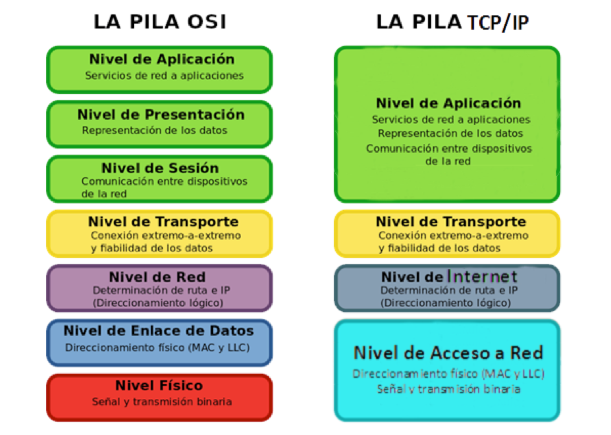
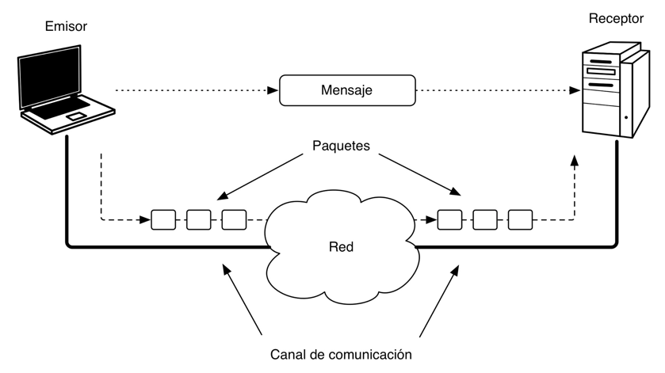
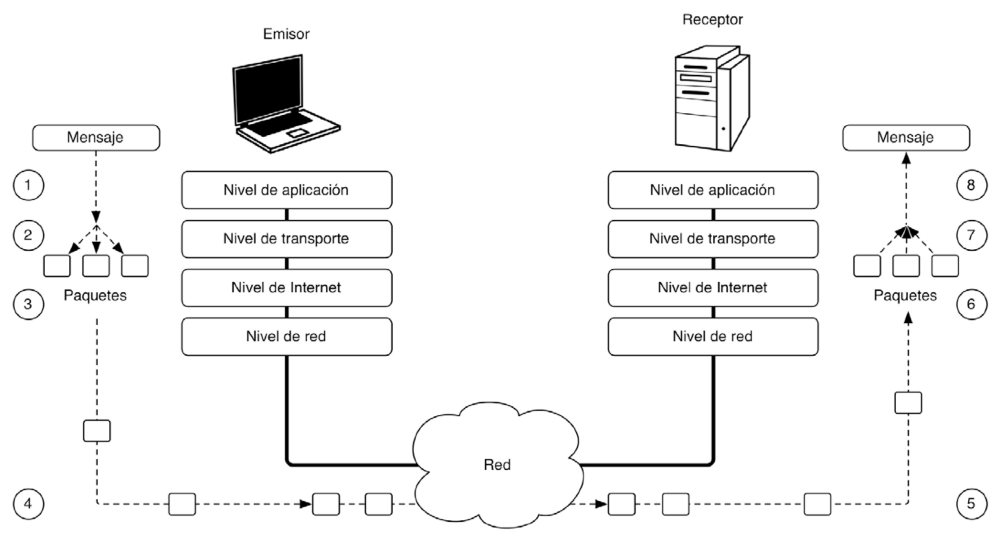

# MARCO TEÓRICO

[VOLVER AL ÍNDICE](0.INDICE.md)

En esta UT vamos a dar un paso más en el desarrollo de aplicaciones concurrentes. Si la UT anterior vimos cómo mejorar la eficiencia de nuestras aplicaciones mediante el uso de hilos, aqui vamos a desplegar estos  hilos no en un sólo equipo, sino en una red de equipos distribuidos. Así, los procesos se ejecutan en distintos procesadores de sistemas independientes, y se comunican a través de una red mediante protocolos estándares de comunicaciones.

## Protocolos de comunicación
Los protocolos de comunicación agrupan al conjunto de reglas que fijan cómo se deben intercambiar paquetes entre los diferentes elementos que se comunican entre sí y fija los estándares que se utilizan para permitir la transmisión de datos entre dispositivos de manera eficiente y confiable. Estos protocolos pueden ser utilizados en diferentes contextos, incluyendo la comunicación entre dispositivos en una red, entre aplicaciones en un sistema operativo o entre sistemas operativos diferentes.

Existen diferentes tipos de protocolos de comunicación, cada uno diseñado para cumplir con un propósito específico:

- **Protocolos de red**: son utilizados para permitir la comunicación entre dispositivos a través de una red, como la Internet o una red local. Ejemplos de protocolos de red incluyen TCP/IP, HTTP y FTP.
- **Protocolos de transporte**: son utilizados para controlar la forma en que los datos son transmitidos entre dispositivos. Ejemplos de protocolos de transporte incluyen TCP y UDP.
- Protocolos de aplicación: son utilizados para permitir la comunicación entre aplicaciones y proporcionar un formato común para el intercambio de datos. Ejemplos de protocolos de aplicación incluyen HTTP y SMTP.
- Protocolos de seguridad: son utilizados para proteger la privacidad y la integridad de la información durante la transmisión. Ejemplos de protocolos de seguridad incluyen SSL y TLS.

Es importante tener en cuenta que los protocolos de comunicación son esenciales para la transmisión de datos en Internet y otras redes. Sin ellos, sería imposible enviar y recibir información de manera confiable.

Es .
- Para que las diferentes aplicaciones que forman un sistema distribuido puedan comunicarse, debe existir una serie de mecanismos que hagan posible esa comunicación:
- Elementos hardware: Switches, Routers, cables...
- Elemento software: IP, TCP, UDP, HTTP, FTP...
- Todos estos componentes se organizan en lo que se denomina una jerarquía o pila de protocolos.

## Comunicación entre Aplicaciones
La comunicación entre aplicaciones es el proceso de intercambio de datos y mensajes entre diferentes aplicaciones o programas. Esta comunicación puede ser realizada de manera local, es decir, entre aplicaciones en el mismo dispositivo, o de manera remota, es decir, entre aplicaciones en diferentes dispositivos conectados a través de una red, como la Internet o una red local. Esta última se puede  utilizar para realizar una variedad de tareas, como la transferencia de archivos, el acceso a bases de datos remotas o la ejecución de procesos en otras máquinas.

Para permitir la comunicación entre aplicaciones a través de la red, se utilizan diversos elementos y tecnologías, entre ellos:

- **Protocolos**: son reglas y estándares que se utilizan para permitir la comunicación entre dispositivos. Algunos ejemplos de protocolos comunes son TCP/IP, HTTP y FTP.
- **Sockets**: son puntos finales de comunicación que se utilizan para enviar y recibir datos a través de una red. Los sockets pueden ser de dos tipos: de flujo (basados en TCP) o de datagrama (basados en UDP).
- **Interfaces de red**: son componentes que se utilizan para acceder a la red y enviar y recibir datos. Algunos ejemplos de interfaces de red son Ethernet y Wi-Fi.
- **Direcciones IP**: son números únicos asignados a dispositivos en una red, que se utilizan para identificar y comunicarse con ellos.

En la comunicación entre aplicaciones a través de la red, es común utilizar lenguajes de programación y librerías que proporcionan funcionalidades para el manejo de sockets y otras operaciones de red. Algunos ejemplos de lenguajes de programación que soportan la comunicación entre aplicaciones a través de la red son Java, Python y C++.

## Roles Cliente y Servidor

En la comunicación entre aplicaciones a través de una red, es común utilizar un modelo de cliente-servidor, en el que una aplicación actúa como cliente y otra aplicación actúa como servidor. Esto significa que el cliente envía solicitudes a través de la red al servidor, y el servidor procesa estas solicitudes y envía respuestas de vuelta al cliente.

Los roles cliente y servidor tienen las siguientes responsabilidades:

El cliente: es la aplicación que inicia la comunicación y envía solicitudes al servidor. El cliente es responsable de formular las solicitudes de manera adecuada y procesar las respuestas del servidor.
El servidor: es la aplicación que recibe solicitudes del cliente y procesa estas solicitudes. El servidor es responsable de recibir y procesar las solicitudes de manera adecuada y enviar respuestas de vuelta al cliente.
Es importante tener en cuenta que el modelo de cliente-servidor es solo uno de los muchos modelos de comunicación entre aplicaciones a través de una red. Otros modelos incluyen el modelo de peer-to-peer, en el que todas las aplicaciones son iguales y pueden actuar tanto como clientes como servidores.

## Protocolo Orientado a la Conexión: TCP
Es aquel en que el canal de comunicaciones entre dos aplicaciones permanece abierto durante un cierto tiempo, permitiendo enviar múltiples mensajes de manera fiable por el mismo.

* Garantiza que los datos no se pierden.
* Garantiza que los mensajes llegarán en orden.

Opera en tres fases:
1. Establecimiento de la conexión.
2. Envío de mensajes.
3. Cierre de la conexión.

## Protocolo No Orientado a la Conexión: UDP
* No es necesario establecer conexiones antes de enviar los mensajes. Esto lo hace más rápido que TCP, 
* **NO** garantiza que los mensajes lleguen siempre.
* **NO** garantiza que los mensajes lleguen en el mismo orden que fueron enviados.
* Permite enviar mensajes de 64 KB como máximo.
* Los mensajes se denominan datagramas

* Direcciónes IP
    * Identifican a una máquina (tarjeta de red) dentro de una red

        Ej: 10.33.45.27

* Puertos: 
    * Identifican una conexión dentro de una máquina
    * 65000 puertos en cada host, en TCP y UDP
* Identificar una conexión
    
    * IP origen, IP destino, Puerto origen, Puerto destino 

Conociendo los dos protocolos anteriores, podemos  distinguir dos modelos particulares:
- Modelo cliente/servidor (GIS), en el que algunos procesos (procesos servidores) proporcionan servicios a otros (procesos clientes). 
- Modelo  P2P (_peer to peer_  o entre iguales), todos los procesos cooperan entre sí y funcionan de manera similar, y no hay una jerarquía ni especialización de los procesos.
