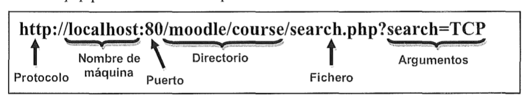

## Elementos de programación de aplicaciones en red. Librerías.

En Java, existen varias librerías que proporcionan funcionalidades para el desarrollo de aplicaciones en red. Algunas de las librerías más comunes son:

- **java.net:** proporciona clases para el uso de sockets y otras funcionalidades de red.
- **java.io:** proporciona clases para la lectura y escritura de datos a través de sockets y otras interfaces de entrada/salida.
- **java.nio:** proporciona clases para la lectura y escritura de datos de manera asíncrona a través de sockets y otras interfaces de entrada/salida.
- **java.rmi:** proporciona clases para el uso de la invocación remota de métodos, que permite a los programas llamar a métodos de objetos en otras máquinas de manera transparente.

Es importante tener en cuenta que para utilizar estas librerías es necesario importarlas en el código de la aplicación y conocer su uso y funcionamiento.

La más comunmente usada es [**java.net**](https://docs.oracle.com/javase/8/docs/api/java/net/package-summary.html) , en la que podemos encontrar las siguientes clases de uso más común:

- La clase **URL**, Uniform Resource Locator (Localizador Uniforme de Recursos): Representa un puntero a un recurso en la Web.

> **NOTA**: La clase URL no crea una conexión real.

- La clase **URLConnection**, crea un enlace  entre el equipo que está solicitando un recurso web y el equipo que lo ofrece. Admite operaciones mas complejas en las URL que la clase anterior.

- Las clases **ServerSocket** y **Socket**, gestionan los sockets TCP. 
  - **ServerSocket**: utilizada por el programa servidor para crear un socket en el puerto en el que escucha las peticiones de conexion de los clientes. 
  - **Socket**: utilizada tanto por el cliente como por el servidor para comunicarse entre si leyendo y escribiendo datos usando streams.

- Las clases **DatagramSocket**, **MulticastSocket** y **DatagramPacket** usadas en la comunicacion mediante UDP.

* La clase **InetAddress**, que se usa para manejar las direcciones de Internet.

### La clase `InetAddress` 

La clase `InetAddress` de Java es una clase que se utiliza para representar direcciones IP en Java. Esta clase proporciona métodos para obtener, parsear y comparar direcciones IP, así como para realizar operaciones de red como el ping y la resolución de nombres de dominio.

Tiene dos subclases: `Inet4Address` para direcciones IPv4 e `Inet6Address` para direcciones IPv6, pero en la mayoría de los casos InetAddress aporta la funcionalidad necesaria y no es necesario recurrir a ellas.

Algunos de los métodos más comunes de la clase `InetAddress` son:

- `getByName()`: este método permite obtener una instancia de InetAddress a partir de un nombre de dominio o dirección IP.
- `getHostName()`: este método permite obtener 
- `getHostAddress()`: este método permite obtener la dirección IP en forma de cadena de caracteres.

A continuación se muestra un ejemplo de cómo obtener la dirección IP de un host a partir de su nombre de dominio:

En la siguiente tabla se muestran algunos métodos importantes de esta clase:
MÉTODOS | DESCRIPCIÓN
| -- | -- |
`InetAddress getLocalHost()`  | Devuelve una instancia de `InetAddress` que representa la dirección IP de la máquina donde se está ejecutando el programa.
isReachable() | este método permite verificar si un host es alcanzable a través de la red.
`InetAddress getByName(String host)`| Devuelve un objeto InetAddress que representa la dirección IP de la máquina que se especifica como parámetro (host). Este parámetro puede ser el nombre de la máquina, un nombre de dominio o una dirección IP.
`InetAddress[] getAllByName(String host)` | Devuelve un array de objetos de tipo InetAddress. Este método es útil para averiguar todas las direcciones IP que tenga asignada una máquina en particular.
`String getHostAddress()` | Devuelve la dirección IP de un objeto InetAddress en forma de cadena.
`String getHostName()` | .Devuelve el el nombre de dominio asociado a una dirección IP.
`String getCanonicalHostName()` | Obtiene el nombre canónico completo (suele ser la dirección real del host) de un objeto InetAddress.

En el siguiente código podemos ver un ejemplo con varios métodos de la clase `InetAddress`:

```java
import java.net.InetAddress;

public class InetAddressMethods {

    public static void main(String s[]) {
        try {
            // Devuelve la dirección de loopback.
            InetAddress addr = InetAddress.getLoopbackAddress();
            System.out.println("La dirección de loopback es " + addr.getHostAddress());
            //It is used to check whether the InetAddress represents local address or not.
            InetAddress addF = InetAddress.getByName("www.facebook.com");
            System.out.println("local address or not:=" + addF.isAnyLocalAddress());
            //It returns true if this address is a link local address
            InetAddress addY = InetAddress.getByName("www.yahoo.com");
            System.out.println("link local address or not:=" + addY.isLinkLocalAddress());
            //is used to check whether the multicast address has a global scope or not.
            InetAddress addC = InetAddress.getByName("www.ctect.com");
            System.out.println("multicast address has global scope or not:=" + addC.isMCGlobal());
            //It is used to check utility routine if the multicast address has link scope or not.
            InetAddress addG = InetAddress.getByName("www.google.com");
            System.out.println("multicast address has link scope or not:=" + addG.isMCLinkLocal());
            // is used to check utility routine if the multicast address has node scope or not.
            InetAddress addJ = InetAddress.getByName("www.javatpoint.com");
            System.out.println("multicast address has node scope or not:=" + addJ.isMCNodeLocal());
            // is used to check utility routine if the multicast address has organization scope or not.
            InetAddress addt = InetAddress.getByName("www.tutorialandexample.com");
            System.out.println("multicast address has organization scope or not:=" + addt.isMCOrgLocal());
        } catch (Exception e) {
            System.out.println(e);
        }
    }

}
```

### La clase URLConnection

Otra de las clases útiles es [**URLConnection**](https://www.javatpoint.com/URLConnection-class), que ofrece una serie de métodos para facilitar comunicación entre nuestras aplicaciones y una URL.

Para conseguir un objeto de este tipo se invoca al método **openConnection()**, con ello obtenemos una conexión al objeto URL referenciado.

Las instancias de esta clase se pueden utilizar tanto para leer como para escribir al recurso referenciado por la URL.

Puede lanzar la excepción *IOException*.

|      MÉTODO    |          DESCRIPCIÓN             |
|----------------|----------------------------------|
| **InputStream getlnputStream()** | Devuelve un objeto InputStream para leer datos de esta conexión. |
| **OutputStream getOutputStream()** | Devuelve un objeto OutputStream para escribir datos en esta conexión. |
| **void setDoInput (boolean b)** | Permite que el usuario reciba datos desde la URL si el parámetro b es true (por defecto está establecidoa true) |
| **void setDoOutput( (boolean b)** | Permite que el usuario envíe datos si el parámetro b es true (no está establecido al principio) |
| **void connect()** | Abre una conexión al recurso remoto si tal conexión no se ha establecido ya. |
| **int getContentLength()** | Devuelve el valor del campo de cabecera content-lenght o -1 si no está definido. |
| **String getContentType()** | Devuelve el valor del campo de cabecera content-type o null si no está definido. |
| **long getDate()** | Devuelve el valor del campo de cabecera date o 0 si no está definido. |
| **long getLastModified()** | Devuelve el valor del campo de cabecera last-modified. |
| **String getHeaderField(int n)** | Devuelve el valor del enésimo campo de cabecera especificado o null si no está definido. |
| **Map< String, List<String> > getHeaderFields()** | Devuelve una estructura Map (estructura de Java que nos permite almacenar pares clave/valor.) con los campos de cabecera. Las claves son cadenas que representan los nombres de los campos de cabecera y los valores son cadenas que representan los valores de los campos correspondientes. |
| **URL getURL()** | Devuelve la dirección URL. |

### La clase URL

La clase **URL** *(Uniform Resource Locator)* representa un puntero a un recurso en la Web, que puede ser desde  un archivo o un directorio, o bien una referencia a algo más complicado, como una consulta a una base de datos.

En general una URL que localiza recursos empleando el protocolo HTTP se divide en varias partes:

` http://host[:puerto][/ruta_del_servidor_al_archivo][?argumentos*]`

> las partes encerradas entre corchetes son opcionales

La imagen siguiente muestra la descripción detallada de cómo se forman las URL:



Los objetos de la clase **URL** se pueden crear de cuatro formas diferentes, dependiendo de los parámetros que se añadan al constructor:

| CONSTRUCTOR                                                    |  MISIÓN |
| -------------------------------------------------------------- | -- |
| URL (String url)                                                | Crea un objeto URL a partir del String indicado en `url` |
| URL(String protocolo, String host, String  fichero)            | Crea un objeto URL a partir de los parámetros protocolo, host y fichero (o directorio).  | 
| URL(String protocolo, String host, int puerto, String fichero) | Crea un objeto URL en el que se especifica el protocolo, host, puerto y fichero (o directorio) representados mediante String.  |
| URL(URL contexto, String especificación)  | Crea un objeto URL analizando la especificación dada dentro de un contexto específico |

El constructor puede lanzar la excepción **MalformedURLException** en caso de que la URL no exista, esté mal construida, o no pueda verificar que realmente exista la máquina o el recurso en la red.

Algunos de los métodos más destacados son los siguientes:

