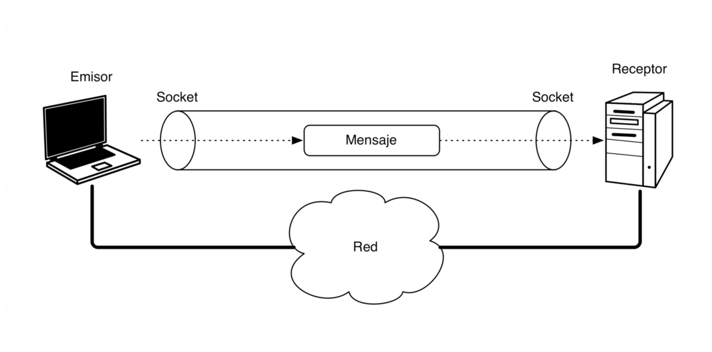

# SOCKETS CON JAVA

<hr>
[VOLVER AL ÍNDICE](I.INDICE.md)
---

Los protocolos TCP y UDP utilizan el concepto de *socket* para favorecer un canal de  comunicación fiable entre aplicaciones o procesos. el concepto recuerda mucho a las tuberías o *pipes* vistos en el tema de procesos. 

La comunicación mediante sockets se sustenta en el concepto de transmisión de un mensaje entre un conector de una aplicación y un conector de otra, a este conector es a lo que llamamos *socket*. 

Los **sockets** son una forma de permitir la comunicación entre procesos a través de una red. Un socket es un punto final de conexión en una red que permite a dos procesos enviar y recibir datos a través de esa conexión.

Los sockets se utilizan comúnmente en aplicaciones de red para permitir la comunicación entre procesos en diferentes dispositivos. Por ejemplo, una aplicación de correo electrónico podría utilizar sockets para conectarse a un servidor de correo y enviar o recibir mensajes.



Algunos aspectos a destacar acerca de los sockets son los siguientes:

* Cada socket tiene un número de puerto asociado a él.

* Este puerto identifica el proceso que esta enviando o recibiendo la información a través del socket.

* Cuando un proceso local quiere comunicarse con un proceso remoto, los dos establecen sus propios números de puerto.

* Cada vez que la información se envía entre ellos, la computadora sabe a que proceso debe recibir la información comprobando el puerto de destino.

> Ejemplo: Sl host A, tiene un proceso PA escuchando en el puerto 33. Cada vez que  A reciba un mensaje con puerto de destino 33, ese mensaje lo recibirá el proceso PA.

Los sockets también se pueden utilizar para permitir la comunicación entre procesos en el mismo dispositivo. Por ejemplo, una aplicación podría utilizar sockets para comunicarse con un servicio en segundo plano en el mismo dispositivo.

La descripción de funcionamiento de una aplicación que incluya sockets se podría resumir en los siguientes pasos:
1.El programa crea un socket con el nombre (IP) de la máquina en la que se ejecuta el servidor y el número de puerto por el que escucha las peticiones. 
2. El cliente elige un puerto local asignado por el sistema para realizar el envío.
3. El servidor acepta la conexión. Una vez aceptada, el servidor obtiene un nuevo socket sobre un puerto diferente. Esto se debe a que por un lado debe seguir atendiendo las peticiones de conexión mediante el socket original y por otro debe atender las necesidades del cliente que se conectó.
4. Si se acepta la conexión, se crea un socket y el cliente puede utilizarlo para comunicarse con el servidor. 

Hay dos tipos básicos de sockets en redes IP: 
- los que utilizan el protocolo **TCP**, orientados a conexión
- y los que utilizan el protocolo **UDP**, no orientados a conexión.

Los sockets **TCP** son una forma de comunicación entre dos puntos en una red que permite que los datos sean transmitidos de manera fiable y ordenada. Algunas de sus caracterísitcas son:
- orientados a la conexión. → se establece una conexión fiable
- Los mensajes llegan ordenados y sin errores (se confirma la recepción de cada mensaje).
- Se usan cuando la integridad de los datos enviados es más importante que la velocidad.
- Más lento que conexiones UDP.

> Ej: FTP → la integridad de los ficheros subidos o descargados es muy importante

**UDP** (User Datagram Protocol) es un protocolo de red sin conexión que se utiliza para enviar mensajes de un host a otro a través de una red. Al contrario que **TCP**, que establece una conexión y garantiza la entrega de los datos, **UDP** simplemente envía los datos sin preocuparse por si llegan o no a su destino. Esto hace que **UDP** sea más rápido y menos costoso que **TCP**, pero también significa que los mensajes pueden perderse o llegar en un orden diferente al esperado.

Resumiendo, algunas características de los sockets **UDP** son:
- No orientado a la conexión → no se establece una conexión fiable.
- Se pueden perder mensajes y / o llegar desordenados (no se confirma nada)
- Se usa cuando la velocidad es más importante que la integridad
- Más rápido que **TCP**.

> Ej: Streaming → es más importante recibir el vídeo rápido que perder un fotograma 


## Creación de sockets. Enlazado y establecimiento de conexiones.
Para el manejo de sockets, JAVA nos ofrece un nivel de abstracción mayor o menor dependiendo del nivel en el que nos encotremos dentro de la pila de comunicaciones TCP/IP.

### Sockets TCP
En Java, podemos utilizar la clase `java.net.Socket` para crear un socket **TCP** y la clase `java.net.ServerSocket` para crear un socket servidor que escucha por conexiones entrantes.

Para crear un socket cliente en Java y conectarse a un servidor, podemos utilizar el siguiente código:

```java
String hostname = "www.example.com";
int port = 80;

Socket socket = new Socket(hostname, port);
```

Para crear un socket servidor que escucha por conexiones entrantes en Java, podemos utilizar el siguiente código:

```java
int port = 80;

ServerSocket serverSocket = new ServerSocket(port);
Socket socket = serverSocket.accept();
```

Por otro lado, el siguiente código implementa un ejemplo de cómo recibir una cadena de texto a través de un socket en Java:

```java
InputStream inputStream = socket.getInputStream();
BufferedReader bufferedReader = new BufferedReader(new InputStreamReader(inputStream));
String message = bufferedReader.readLine();
```

Es importante tener en cuenta que los sockets **TCP** deben cerrarse cuando ya no son necesarios, para liberar los recursos del sistema. Esto se puede hacer llamando al método socket.close().

### SOCKETS UDP
En Java, podemos utilizar la clase `java.net.DatagramSocket` para enviar y recibir mensajes **UDP**. Para enviar un mensaje, podemos crear una instancia de `DatagramPacket`, que representa un paquete de datos **UDP**, y enviarlo a través de un `DatagramSocket`:

```java
String message = "Hola mundo!";
byte[] data = message.getBytes();

InetAddress address = InetAddress.getByName(host);
int port = 1234;

DatagramPacket packet = new DatagramPacket(data, data.length, address, port);
DatagramSocket socket = new DatagramSocket();
socket.send(packet);
```

Para recibir un mensaje, podemos crear un `DatagramPacket` vacío y llamar al método `receive` del `DatagramSocket`, que rellenará el paquete con los datos del mensaje recibido:

```java
byte[] buffer = new byte[1024];
DatagramPacket packet = new DatagramPacket(buffer, buffer.length);
DatagramSocket socket = new DatagramSocket(port);
socket.receive(packet);

String message = new String(packet.getData(), 0, packet.getLength());
```

Es importante tener en cuenta que, al contrario que con los sockets TCP, no es necesario crear un servidor UDP para escuchar por mensajes entrantes. Una vez que hemos creado un `DatagramSocket`, podemos utilizarlo tanto para enviar como para recibir mensajes.

## REFERENCIAS

[Wikipedia](https://es.wikipedia.org/wiki/Protocolo_de_datagramas_de_usuario)

