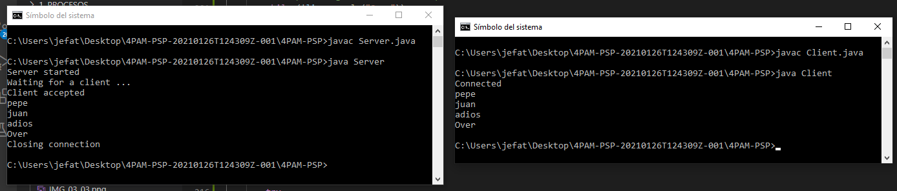
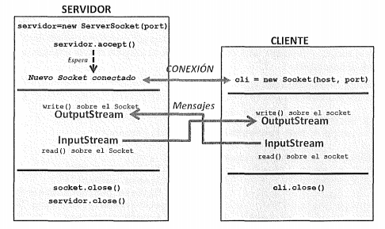

# SOCKETS TCP

<hr>
[VOLVER AL ÍNDICE](I.INDICE.md)
---

Ya hemos visto que el protocolo TCP es un protocolo orientado a ofrecer una conexión fiable, por lo que para establecer una comunicación es necesario especificar una conexión entre un par de sockets. 

El socket del cliente es el que solicita una conexión, y el del servidor queda a la espera para atender las peticiones de los clientes. Una vez que el servidor acepta la conexión entrante, ambos sockets quedan conectados y se pueden utilizar para transmitir datos de manera bidireccional

El proceso de comunicación se podría resumir de la siguiente manera:


### Sockets TPC → Servidor:

El procedimiento básico es el siguiente:

1. Creación del objeto ServerSocket (se puede especificar el puerto en el constructor). 
2. Asignación de dirección y puerto (.bind). (OPCIONAL)
3. Escucha en el puerto
4. Aceptación de conexiones (.accept). Esta operación implica la creación de un nuevo socket, que se usa para comunicarse con el cliente que se ha conectado.
5. Obtener del socket establecido Input y Output Streams para poder comunicarse con el cliente (.getInputStream .getOutputStream)
6. Envío y recepción de mensajes.(read y write)
7. Cierre de la conexión (close).

El siguiente código crea una aplicación servidor que recibe mensajes de texto mediante un objeto *DataInputStream* y los muestra por pantalla hasta que recibe el mensaje "Over" y cierra la conexión y finaliza el programa.

```JAVA
// A Java program for a Server 
import java.net.*; 
import java.io.*; 

public class Server 
{ 
	//initialize socket and input stream 
	private Socket		 socket = null; 
	private ServerSocket server = null; 
	private DataInputStream in	 = null; 

	// constructor with port 
	public Server(int port) 
	{ 
		// starts server and waits for a connection 
		try
		{ 
			server = new ServerSocket(port); 
			System.out.println("Server started"); 

			System.out.println("Waiting for a client ..."); 

			socket = server.accept(); 
			System.out.println("Client accepted"); 

			// takes input from the client socket 
			in = new DataInputStream( 
				new BufferedInputStream(socket.getInputStream())); 

			String line = ""; 

			// reads message from client until "Over" is sent 
			while (!line.equals("Over")) 
			{ 
				try
				{ 
					line = in.readUTF(); 
					System.out.println(line); 

				} 
				catch(IOException i) 
				{ 
					System.out.println(i); 
				} 
			} 
			System.out.println("Closing connection"); 

			// close connection 
			socket.close(); 
			in.close(); 
		} 
		catch(IOException i) 
		{ 
			System.out.println(i); 
		} 
	} 

	public static void main(String args[]) 
	{ 
		Server server = new Server(5000); 
	} 
} 
```

[DESCARGAR CÓDIGO](Server.java)


### Sockets TCP → Cliente:

En este caso, el procedimiento queda de la siguiente manera:

1. Creación del objeto Socket.Se puede especificar dirección y puerto en el constructor.
2. Conexión del socket (connect).
3. Obtenención del socket estableciendo Input y Output Streams para poder comunicarse con el cliente (.getInputStream .getOutputStream)
4. Envío y recepción de mensajes.
5. Cierre de la conexión (close).

```JAVA
import java.net.*;
import java.io.*; 

public class Client
{
	// inicializamos socket and input-output streams y el bufferedreader
	private Socket socket		 = null;
	private DataInputStream input = null;
    private DataOutputStream out	 = null;
    private BufferedReader br = null;

	// constructor to put ip address and port
	public Client(String address, int port)
	{
        // establish a connection
		try
		{
			socket = new Socket(address, port);
			System.out.println("Connected");

			// definimos una entrada por terminal (teclado)
            input = new DataInputStream(System.in);
            
            br = new BufferedReader(new InputStreamReader(input));

			// sends output to the socket
			out = new DataOutputStream(socket.getOutputStream());
		}
		catch(UnknownHostException u)
		{
			System.out.println(u);
		}
		catch(IOException i)
		{
			System.out.println(i);
		}

		// string to read message from input
		String line = "";

		// keep reading until "Over" is input
		while (!line.equals("Over"))
		{
			try
			{
                line = br.readLine();
				out.writeUTF(line);
			}
			catch(IOException i)
			{
				System.out.println(i);
			}
		}

		// close the connection
		try
		{
			input.close();
			out.close();
			socket.close();
		}
		catch(IOException i)
		{
			System.out.println(i);
		}
	}

	public static void main(String args[])
	{
		Client client = new Client("127.0.0.1", 5000);
	}
}
```


Si compilamos cada aplicación en un terminal distinto y las ejecutamos al mismo tiempo, podemos ver el resultado:



El funcionamiento de esta aplicación básica, explicada de manera gráfica y relacionándola con las fases del proceso de comunicación explicado anteriormente, quedaría de esta manera:


