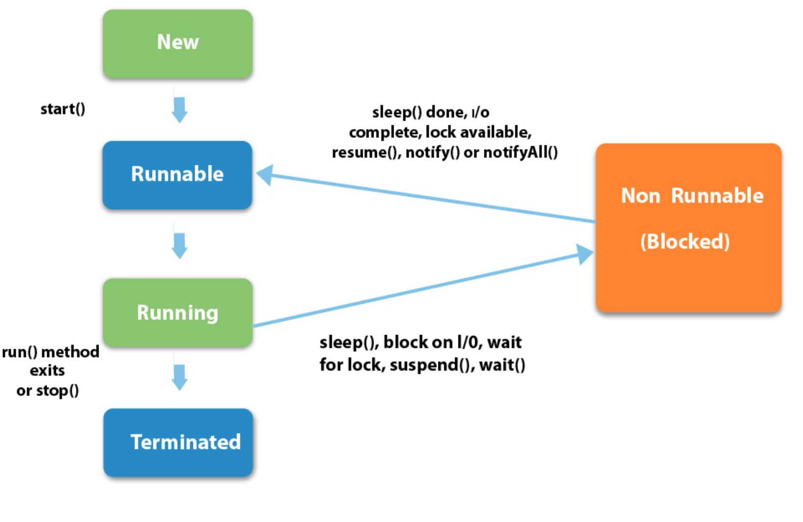

# INTRODUCCIÓN

## A) DEFINICIÓN 

Los hilos, o *Threads*, son la unidad básica de utilización de la CPU, y más concretamente de un core del procesador. Así un thread se puede definir como la secuencia de código que está en ejecución, pero embebida en el contexto de trabajo de un proceso.

La diferencia entre un hilo y un proceso es que los procesos son independientes, tienen su espacio de direcciones de memoria separado y compiten en igualdad de condiciones entre ellos por el uso de la CPU, tanto si comparten padre como si son independientes.

Sin embargo, en un hilo, lo que hace el proceso es crear un espacio privado de direcciones dentro de su espacio de direcciones, por lo que la pugna por competir por el tiempo de procesador se verá en “inferioridad de condiciones” respecto a un proceso padre–hijo.

Algunas características de los hilos son:

- Un hilo no puede existir independientemente de un proceso.
- Un hilo no puede ejecutarse por si solo.
- Dentro de cada proceso puede haber varios hilos ejecutándose.
- Un único hilo es similar a un programa secuencial; por si mismo no nos ofrece nada nuevo. Es la habilidad de ejecutar varios hilos dentro de un proceso lo que ofrece algo nuevo y útil,
ya que cada uno de estos hilos puede ejecutar actividades diferentes al mismo tiempo.

Como consecuencia de compartir el espacio de memoria, los hilos aportan las siguientes
ventajas sobre los procesos:

- Se consumen menos recursos en el lanzamiento y la ejecución de un hilo que en el
lanzamiento y ejecución de un proceso.
- Se tarda menos tiempo en crear y terminar un hilo que un proceso.
- La conmutación entre hilos del mismo proceso es bastante más rápida que entre

    procesos.

Es por esas razones, por lo que a los hilos se les denomina también procesos ligeros.

Se aconseja utilizar hilos en una aplicación cuando:

- La aplicación maneja entradas de varios dispositivos de comunicación.
- La aplicación debe poder realizar diferentes tareas a la vez.
- Interesa diferenciar tareas con una prioridad variada. Por ejemplo, una prioridad alta
para manejar tareas de tiempo crítico y una prioridad baja para otras tareas.
- La aplicación se va a ejecutar en un entorno multiprocesador.

Hablamos de multihilo cuando se ejecutan varias tareas paralelamente dentro de una misma aplicación. En este caso no son procesos diferentes sino que dichas tareas se ejecutan dentro del mismo proceso del Sistema Operativo. A cada una de estas tareas se le conoce como hilo o thread (en algunos contextos también como procesos ligeros).

El uso de varios hilos dentro de una aplicación se conoce como **Programación Concurrente**.

## B) ESTADOS DE UN HILO

Una vez que hemos visto una pequeña introducción a los hilos, podemos entrar a ver cómo funcionan a nivel organizativo:

A) Inicialmente, se crea la instancia de la clase que implementa el hilo (Thread).

B) Al invocar al método **start()** el hilo pasa a estado *ejecutable* (*Runnable*) a la espera de que el gestor de JVM le conceda acceso y permisos para su ejecución.

C) Cuando eso sucede, el hilo pasa a estado *ejecutándose*.

D) De ese estado puede salir a un estado *no ejecutable* en caso de se innvoque la método *sleep* o parecido.

E) El hilo termina cuando acaba de ejecutarse el código del mismo o bien se invoca al método *stop*. (esta segunda opción está descartada por no poder usar el método)

Gráficamente el resultado es el siguiente:

## C) REFERENCIAS Y RECURSOS USADOS
* Imagen 1:
    * [Libro "Programación de Servicios y Procesos" Ed. ra-ma](https://www.ra-ma.es/libro/programacion-de-servicios-y-procesos-grado-superior_49240/)
* Imagen 2:
    * [https://www.educative.io/edpresso/how-to-use-threads-in-java](https://www.educative.io/edpresso/how-to-use-threads-in-java)
