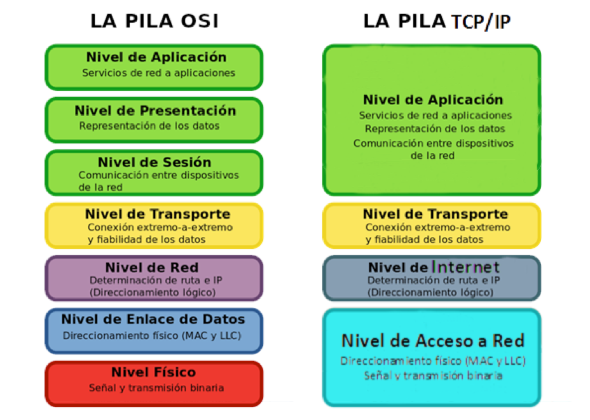

## Sistema Distribuido

- Está formado por más de un elemento computacional distinto e independiente (un procesador dentro de una máquina, un ordenador dentro de una red, etc), que no comparte memoria con el resto.
- Los elementos que forman el sistema distribuido no están sincronizados: No hay reloj común.
- Los elementos que forman el sistema están conectados a una red de comunicaciones.

## Comunicación entre Aplicaciones

## Protocolo de comunicaciones:
- Es el conjunto de reglas que fijan cómo se deben intercambiar paquetes entre los diferentes elementos que se comunican entre sí.
- Para que las diferentes aplicaciones que forman un sistema distribuido puedan comunicarse, debe existir una serie de mecanismos que hagan posible esa comunicación:
- Elementos hardware: Switches, Routers, cables...
- Elemento software: IP, TCP, UDP, HTTP, FTP...
- Todos estos componentes se organizan en lo que se denomina una jerarquía o pila de protocolos.

## PROCESO DE COMUNICACIONES

## Protocolo Orientado a la Conexión: TCP
Es aquel en que el canal de comunicaciones entre dos aplicaciones permanece abierto durante un cierto tiempo, permitiendo enviar múltiples mensajes de manera fiable por el mismo.

* Garantiza que los datos no se pierden.
* Garantiza que los mensajes llegarán en orden.

Opera en tres fases:
1. Establecimiento de la conexión.
2. Envío de mensajes.
3. Cierre de la conexión.

## Protocolo No Orientado a la Conexión: UDP
* No es necesario establecer conexiones antes de enviar los mensajes. Esto lo hace más rápido que TCP, 
* **NO** garantiza que los mensajes lleguen siempre.
* **NO** garantiza que los mensajes lleguen en el mismo orden que fueron enviados.
* Permite enviar mensajes de 64 KB como máximo.
* Los mensajes se denominan datagramas

* Direcciónes IP
    * Identifican a una máquina (tarjeta de red) dentro de una red

        Ej: 10.33.45.27

* Puertos: 
    * Identifican una conexión dentro de una máquina
    * 65000 puertos en cada host, en TCP y UDP
* Identificar una conexión
    * IP origen, IP destino, Puerto origen, Puerto destino 