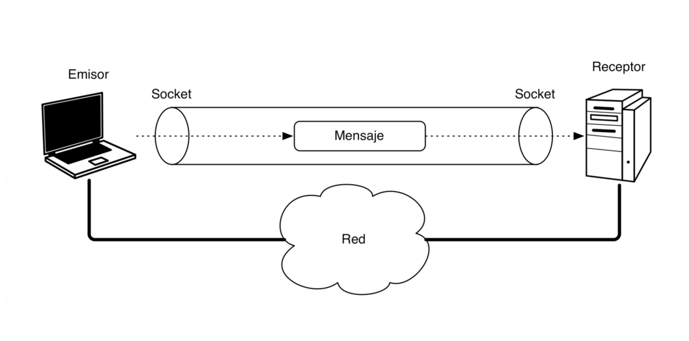

* Nos vamos a centrar en la comunicación de aplicaciones a través de una red, a bajo nivel 
    
    → Sockets
* Proporcionan una abstracción de la pila de protocolos.
* Un Socket es un sistema de comunicación entre procesos ejecutándose en diferentes máquinas en una red.
* Estos procesos envían y reciben información  través de un conector → socket.

* Cada socket tiene un número de puerto asociado a él.
* Este puerto identifica el proceso que esta enviando o recibiendo la información a través del socket.
* Cuando un proceso local quiere comunicarse con un proceso remoto, los dos establecen sus propios números de puerto.
* Cada vez que la información se envía entre ellos, la computadora sabe a que proceso debe recibir la información comprobando el puerto de destino.
* Ejemplo: Sl host A, tiene un proceso PA escuchando en el puerto 33. Cada vez que el A reciba un mensaje con puerto de destino 33, ese mensaje lo recibirá el proceso PA.
