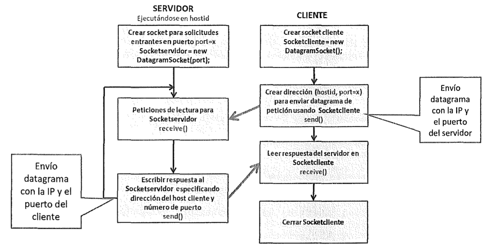
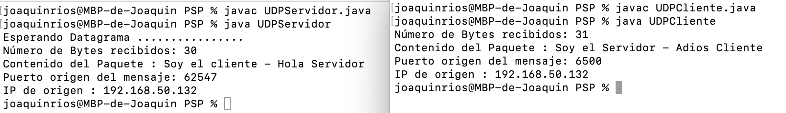

# SOCKETS
## INTRODUCCIÓN TEÓRICA GENERAL
Los protocolos TCP y UDP utilizan el concepto de *socket* para favorecer un canal de  comunicación fiable entre aplicaciones o procesos. el concepto recuerda mucho a las tuberías o *pipes* vistos en el tema de procesos. 

La comunicación mediante sockets se sustenta en el concepto de transmisión de un mensaje entre un conector de una aplicación y un conector de otra, a este conector es a lo que llamamos *socket*. 

JAVA nos permite un nivel de abstracción mayor o menor dependiendo del nivel en el que nos encotremos dentro de la pila de comunicaciones TCP/IP.


Algunos aspectos a destacar acerca de los sockets son los siguientes:
* Cada socket tiene un número de puerto asociado a él.
* Este puerto identifica el proceso que esta enviando o recibiendo la información a través del socket.
* Cuando un proceso local quiere comunicarse con un proceso remoto, los dos establecen sus propios números de puerto.
* Cada vez que la información se envía entre ellos, la computadora sabe a que proceso debe recibir la información comprobando el puerto de destino.
    
    Ejemplo: Sl host A, tiene un proceso PA escuchando en el puerto 33. Cada vez que el A reciba un mensaje con puerto de destino 33, ese mensaje lo recibirá el proceso PA.

### Comunicación Cliente – Servidor
- Servidor permanece escuchando en un puerto dado, esperando peticiones de un Cliente.
    - Hay puertos estándar para servicios estándar: http, ftp, ssh, dns, ...
    - Cuando recibe una petición la procesa y envía la respuesta.
    - Rol pasivo en la comunicación 
- Cliente, que debe saber la dirección IP y el puerto del Servidor le envía mensajes y espera la respuesta.
    - El puerto del cliente se asigna aleatoriamente (> 1023 que son los estándar).
    - Rol activo en la comunicación
- Cuando un cliente se conecta a un servidor, se establece el socket de comunicación
por el que el cliente manda peticiones al servidor y el servidor envía las respuestas apropiadas al cliente

    Ej: protocolo http (web)
- Una vez establecida la conexión, el servidor sigue escuchando por el mismo puerto a otros clientes que pueden establecer otras conexiones.

### Tipos de Sockets
- **Sockets TCP**: 
    - orientados a la conexión. → se establece una conexión fiable
    - Los mensajes llegan ordenados y sin errores (se confirma la recepción de cada mensaje).
    - Se usan cuando la integridad de los datos enviados es más importante que la velocidad.
    - Más lento que conexiones UDP.

    Ej: FTP → la integridad de los ficheros subidos o descargados es muy importante
- **Sockets UDP**: 
    - No orientado a la conexión → no se establece una conexión fiable.
    - Se pueden perder mensajes y / o llegar desordenados (no se confirma nada)
    - Se usa cuando la velocidad es más importante que la integridad
    - Más rápido que TCP

    Ej: Streaming → es más importante recibir el vídeo rápido que perder un fotograma

## HERRAMIENTAS DE RED EN JAVA
Previamente a entrar en la coumunicación a través de sockets con JAVA, vamos a ver algunas utlidades que ofrecen las librerías de java.net para las comunicaciones.

Las clases de uso más común son:
* La clase **URL**, Uniform Resource Locator (Localizador Uniforme de Recursos): Representa un puntero a un recurso en la Web.
> La clase URL no crea una conexión real,

* La clase **URLConnection**, crea un enlace  entre el equipo que está solicitando un recurso web y el equipo que lo ofrece. Admite operaciones mas complejas en las URL que la clase anterior.

* Las clases **ServerSocket** y **Socket**, gestionan los sockets TCP. 
	- **ServerSocket**: utilizada por el programa servidor para crear un socket en el puerto en el que escucha las peticiones de conexion de los clientes. 
	- **Socket**: utilizada tanto por el cliente como por el servidor para comunicarse entre si leyendo y escribiendo datos usando streams.

* Las clases **DatagramSocket**, **MulticastSocket** y **DatagramPacket** usadas en la comunicacion mediante UDP.

* La clase **InetAddress**, que para manejar
las direcciones de Internet.


### La clase IntetAddress
 
Si hacemos uso de la Clase **InetAddress**, podemos obetner la representación de una dirección IP en Java. Dicha clase dispone de métodos para conectarse a un servidor DNS y resolver un nombre de host.

Me permite conectarme a un servidor por el nombre de dominio y automáticamente obtiene la IP 

Para crear un objeto **InetAddress** usamos alguno de los métodos estáticos mostrados en la tabla siguiente:


|MÉTDODO | DESCRIPCIÓN |
|--------|-------------|
**InetAddress getLocalHost()** | Devuelve un objeto de tipo *InetAddress* con los datos de direccionamiento locales.
**InetAddress getByName(String nombre_host)**| Devuelve un objeto de tipo InetAddress con los datos el direccionamiento según el nombre que le pasamos como parámetro. Puede devolver una Exception del tipo *UnknownHostException* si el nombre pasado como parámetro no puede ser resuelto.
**InetAddress getAllByName(String nombre_host)**| Devuelve un array de objetos de tipo InetAddress con los datos del direccionamiento del nombre pasado como parámetro. Puede devolver una Exception del tipo *UnknownHostException* si el nombre pasado como parámetro no puede ser resuelto.
**byte[] getAddress()**| Retorna la dirección IP
**String getHostAddress()**| Retorna La representación en texto de la IP
**String getHostName()**| Retorna la representación en texto del nombre de host.
**boolean isReachable(int tiempo)**| Retorna *TRUE* o *FALSE* si la dirección es alcanzable en el tiempo establecido como parámetro.

### La clase URLConnection
Otra de las clases útiles que ofrece JAVA es **URLConnection**, con una serie de métodos que 

## SOCKETS EN JAVA
Dentro del paquete java.net podemos encontrar las clases **ServerSocket** y **Socket** para trabajar con sockets.

Clase **ServerSocket** : 
- Implementa el socket en el lado del servidor
- Escucha peticiones de conexión de clientes en un puerto


Clase **Socket**: 
- Implementa el socket en el lado del cliente.
- mantiene la comunicación entre cliente y servidor

Vamos a estudiar los dos protocolos del nivel de transporte y cómo se pueden gestionar con JAVA.


### TCP
Ya hemos visto que el protocolo TCP es un protocolo orientado a ofrecer una conexión fiable, por lo que para establecer una comunicación es necesario especificar una conexión entre un par de sockets. 

El socket del cliente es el que solicita una conexión, y el del servidor queda a la espera para atender las peticiones de los clientes. Una vez que el servidor acepta la conexión entrante, ambos sockets quedan conectados y se pueden utilizar para transmitir datos de manera bidireccional

El proceso de comunicación se podría resumir de la siguiente manera:


### Sockets TPC → Servidor:
El procedimiento básico es el siguiente:
1. Creación del objeto ServerSocket (se puede especificar el puerto en el constructor). 
2. Asignación de dirección y puerto (.bind). (OPCIONAL)
3. Escucha en el puerto
4. Aceptación de conexiones (.accept). Esta operación implica la creación de un nuevo socket, que se usa para comunicarse con el cliente que se ha conectado.
5. Obtener del socket establecido Input y Output Streams para poder comunicarse con el cliente (.getInputStream .getOutputStream)
6. Envío y recepción de mensajes.(read y write)
7. Cierre de la conexión (close).

El siguiente código crea una aplicación servidor que recibe mensajes de texto mediante un objeto *DataInputStream* y los muestra por pantalla hasta que recibe el mensaje "Over" y cierra la conexión y finaliza el programa.

```JAVA
// A Java program for a Server 
import java.net.*; 
import java.io.*; 

public class Server 
{ 
	//initialize socket and input stream 
	private Socket		 socket = null; 
	private ServerSocket server = null; 
	private DataInputStream in	 = null; 

	// constructor with port 
	public Server(int port) 
	{ 
		// starts server and waits for a connection 
		try
		{ 
			server = new ServerSocket(port); 
			System.out.println("Server started"); 

			System.out.println("Waiting for a client ..."); 

			socket = server.accept(); 
			System.out.println("Client accepted"); 

			// takes input from the client socket 
			in = new DataInputStream( 
				new BufferedInputStream(socket.getInputStream())); 

			String line = ""; 

			// reads message from client until "Over" is sent 
			while (!line.equals("Over")) 
			{ 
				try
				{ 
					line = in.readUTF(); 
					System.out.println(line); 

				} 
				catch(IOException i) 
				{ 
					System.out.println(i); 
				} 
			} 
			System.out.println("Closing connection"); 

			// close connection 
			socket.close(); 
			in.close(); 
		} 
		catch(IOException i) 
		{ 
			System.out.println(i); 
		} 
	} 

	public static void main(String args[]) 
	{ 
		Server server = new Server(5000); 
	} 
} 
```
[DESCARGAR CÓDIGO](CODIGO/Server.java)


### Sockets TCP → Cliente:
En este caso, el procedimiento queda de la siguiente manera:

1. Creación del objeto Socket.Se puede especificar dirección y puerto en el constructor.
2. Conexión del socket (connect).
3. Obtenención del socket estableciendo Input y Output Streams para poder comunicarse con el cliente (.getInputStream .getOutputStream)
4. Envío y recepción de mensajes.
5. Cierre de la conexión (close).

```JAVA
import java.net.*;
import java.io.*; 

public class Client
{
	// inicializamos socket and input-output streams y el bufferedreader
	private Socket socket		 = null;
	private DataInputStream input = null;
    private DataOutputStream out	 = null;
    private BufferedReader br = null;

	// constructor to put ip address and port
	public Client(String address, int port)
	{
        // establish a connection
		try
		{
			socket = new Socket(address, port);
			System.out.println("Connected");

			// definimos una entrada por terminal (teclado)
            input = new DataInputStream(System.in);
            
            br = new BufferedReader(new InputStreamReader(input));

			// sends output to the socket
			out = new DataOutputStream(socket.getOutputStream());
		}
		catch(UnknownHostException u)
		{
			System.out.println(u);
		}
		catch(IOException i)
		{
			System.out.println(i);
		}

		// string to read message from input
		String line = "";

		// keep reading until "Over" is input
		while (!line.equals("Over"))
		{
			try
			{
                line = br.readLine();
				out.writeUTF(line);
			}
			catch(IOException i)
			{
				System.out.println(i);
			}
		}

		// close the connection
		try
		{
			input.close();
			out.close();
			socket.close();
		}
		catch(IOException i)
		{
			System.out.println(i);
		}
	}

	public static void main(String args[])
	{
		Client client = new Client("127.0.0.1", 5000);
	}
}
```
[DESCARGAR CÓDIGO](CODIGO/Client.java)

Si compilamos cada aplicación en un terminal distinto y las ejecutamos al mismo tiempo, podemos ver el resultado:


El funcionamiento de esta aplicación básica, explicada de manera gráfica y relacionándola con las fases del proceso de comunicación explicado anteriormente, quedaría de esta manera:


## SOCKETS UDP

PROTOCOLO UDP

El protocolo **UDP**, al igual que el TCP, opera en el nivel de transporte dentro de la capa de protocolos IP, y es otro de los componentes fundamentales de la pila IP. 

En este nivel, la información se separa en paquetes (o  mensajes) se denominan "datagramas" (datagrams en inglés).

Las funcionalidades que ofrece al nivel de aplicación lo asemeja con TCP, pero su funcionamiento es diferente en algunos aspectos:

* En primer lugar, se trata de un protocolo no orientado a conexion, por lo que orfece mas rapidez que TCP, ya que no es
necesario realizar el "*handshake*" para establecer la conexión.

* Su fiabilidad es menor, no está garantizado que lleguen todos los mensajes.

* El orden de llegada de los paquetes en el mismo orden
que fueron enviados, puede no respetarse.

* La longitud máxima de cada paquete es de 64 KB como maximo.


Al ser mucho mas ligero y eficiente que TCP, es muy extendido su uso en la programación distribuida.

También usado de manera frecuente en la transmisión de vídeo y voz a través de una red. Esto es porque no hay tiempo para enviar de nuevo paquetes perdidos cuando se está escuchando a alguien o viendo un vídeo en tiempo real.

Si usamos sockets UDP, al no crear una conexión (como es el caso de socket TCP), los mensajes o paquetes se gestionan de forma individual y no se garantiza la recepción o envío del mensaje como si ocurre en TCP.

Las dos clases de uso común son:
### Clase **DatagramPacket**
Implementa los objetos (paquetes) que se enviarán y  recibirán en un DatagramSocket. 

El constructor de esta clase puede recibir las siguientes configuraciones de inicio:

|MÉTDODO | DESCRIPCIÓN |
|--------|-------------|
| **DatagramPacket(byte[] buf, int length)** | Constructor para datagramas recibidos. Se especifica la cadena de bytes en la que alojar el mensaje (bu!) y la longitud (length) de la misma.
| **DatagramPacket(byte[] buf, int offset, int length)** | Constructor para datagramas recibidos. Se especifica la cadena de bytes en la que alojar el mensaje, la longitud de la misma y el offset (offset) dentro de la cadena.
| **DatagramPacket(byte[] buf, int length, lnetAddress addrss, int port)** | Constructor para el envío de datagramas. Se especifica la cadena de bytes a enviar (**buf**), la longitud (**length**), el número de puerto de destino (**port**) y el el *host* especificado en la dirección **addrss**.
| **DatagramPacket(byte[] buf, int offset, int length, lnetAddress address, int port)** | Constructor para el envío de datagramas. Igual que el anterior pero se especifica un *offset* dentro de la cadena de bytes.

Los métodos de esta clase son:

|MÉTDODO | DESCRIPCIÓN |
|--------|-------------|
| **InetAddress getAddress ()** | Devuelve la dirección IP del hostal cual se le envía el datagrama o del que el datagrama se recibió.
| **byte[] getData()** | Devuelve el mensaje contenido en el datagrama tanto recibido como enviado.
| **int getLength ()** | Devuelve la longitud de los datos a enviar o a recibir.
| **int getPort())** | evuelve el número de puerto de la máquina remota a la que se le va a enviar el datagrama o del que se recibió el datagrama.
| **setAddress (InetAddress addr)** | Establece la dirección IP de la máquina a la que se envía el datagrama.
| **setData (byte [buf])** | Establece el búfer de datos para este paquete.
| **setLength (int length)**| Ajusta la longitud de este paquete.
| **setPort (int Port)** | Establece el número de puerto del host remoto al que este datagrama se envía.


### Clase **DatagramSocket**
Implementa una comunicación UDP. Envía y recibe objeto de tipo *DatagramPacket*.

El constructor se puede inicializar de las siguientes formas:

|CONSTRUCTOR | DESCRIPCIÓN |
|--------|-------------|
**DatagramSocket()** | Construye un socket para datagramas, el sistema elige un puerto de los que están libres.
**DatagramSocket (int port)** | 
**DatagramSocket (int port, InetAddress ip)**| Permite especificar, además del puerto, la dirección local a la que se va a asociar el socket.

Los métodos más usados son:

|MÉTDODO | DESCRIPCIÓN |
|--------|-------------|
**receive (DatagramPacket paquete)**| Recibe un DatagramPacket del socket, y llena paquete con los datos que recibe (mensaje, longitud y origen). Puede lanzar la excepción *IOException*.
**send(DatagramPacket paquete)** | Envía un DatagramPacket a través del socket. El argumento paquete contiene el mensaje y su destino. Puede lanzar la excepción *IOException*.
**close()**| Se encarga de cerrar el socket.
**int getLocalPort()** | Devuelve el número de puerto en el host local al que está enlazado el socket, -1 si el socket está cerrado y O si no está enlazado a ningún puerto.
**int getPort()**| Devuelve el número de puerto al que está conectado el socket, -1 si no está conectado.
**connect(lnetAddress address, int port)** | Conecta el socket a un puerto remoto y una dirección IP concretos, el socket solo podrá enviar y recibir mensajes desde esa dirección.
**setSoTimeout(int timeout)** | Permite establecer un tiempo de espera límite. Entonces el método **receive()** se bloquea durante el tiempo fijado. Si no se reciben datos en el tiempo fijado se lanza la excepción *InterruptedIOException*.

El funcionamiento de las aplicaciones usando UDP se puede mostrar gráficamente usando la siguiente imagen:



Y su explicación sería de la siguiente manera:
#### UDPServidor.java:
1. Creamos un **DatagramSocket** asociado a un puerto local para escuchar peticiones de clientesy queda a la espera de recibir peticiones.
2. Creamos un **DatagramPacket** donde guardar los datos a enviar.
3. Mediante el método **receive()**, el servidor recibe las peticiones  del socket. Como en el contenido del datagrama va incluido el puerto y la IP del cliente emisor, el servidor puede conocer la dirección del emisor del datagrama.
4.  El servidor construye su **DatagramPacket** con el mensaje a enviar y los datos obtenidos del cliente.
5. Utilizamos el método **send()** para enviar la respuesta al cliente.
6. El servidor permanece a la espera de recibir más peticiones.

El código sería el siguiente:

```java
import java.io.IOException;
import java.net.DatagramPacket;
import java.net.DatagramSocket;
import java.net.InetAddress;

/**
 *
 * @author profesor
 */

public class UDPServidor {

	public static void main(String[] args) {
		// Creamos el DatagramSocket escuchando en el puerto 6500 y la ip local
		try (DatagramSocket mySocket = new DatagramSocket(6500, InetAddress.getLocalHost())) {
			
			System.out.println("Esperando Datagrama ................");
			
			// Recibimos el mensaje de la misma manera que el cliente.
			byte[] buffer = new byte[1024];
			DatagramPacket packetCliente = new DatagramPacket(buffer, buffer.length);
			mySocket.receive(packetCliente);
			
			// Obtenemos el puerto para responder al cliente 
			int destPort = packetCliente.getPort();
			//Obtenemos la IP para responder al cliente
			InetAddress destAddr = packetCliente.getAddress();
			//Obtenemos numero de bytes recibidos
			int bytesRec = packetCliente.getLength();
			//obtengo String de los datos recibidos
			String paquete= new String(packetCliente.getData());
			
			
			//VISUALIZO INFORMACIÓN RECIBIDA 
			System.out.println("Número de Bytes recibidos: " + bytesRec);
			System.out.println("Contenido del Paquete : " + paquete.trim());
			System.out.println("Puerto origen del mensaje: " + destPort);
			System.out.println("IP de origen : " + destAddr.getHostAddress());
			
			// Preparamos la respuesta al cliente con los datos del packetCliente
				// Crear el mensaje de respuesta
			String saludo = "Soy el Servidor - Adios Cliente";
			byte[] message = saludo.getBytes();
				// Crear el DatagramPacket
			DatagramPacket packetServidor = new DatagramPacket(message, message.length, destAddr, destPort);
				// enviarlo por el socket
			mySocket.send(packetServidor);
		} catch (IOException e) {
			System.out.println(e);
		}
	}

}
```
[UDPServidor.java](CODIGO/UDPServidor.java)

#### UDPCliente.java:
1. El cliente crea otro **DatagramSocket** para comunicarse con el servidor, del que necesita conocer su IP y el puerto por el que escucha. 
2. Creamos un **DatagramPacket** donden guardar los datos a enviar.
3. Con el método **send()**, enviamos la petición en forma de datagrama.
3. Creamos un segundo **DatagramPacket** donde guardar los datos a enviar. 
4. El servidor 
5. El cliente recibe la respuesta del servidor usando el método **receive()** del socket. 

Y el código es:

```java
import java.io.IOException;
import java.net.DatagramPacket;
import java.net.DatagramSocket;
import java.net.InetAddress;

public class UDPCliente {

	public static void main(String[] args) {
		// El socket del cliente, utiliza la IP local y el puerto disponible que se le asigne
		try (DatagramSocket mySocket = new DatagramSocket()) {
			// Crear el paquete a enviar
			String text = "Soy el cliente - Hola Servidor";
				// array de bytes.
			byte[] message = text.getBytes();
				// creamos el paquete con el mensaje, la longitud, la IP y el puerto
				// La direccion del servidor la conocemos con getLocalHost(),
				// ya que esta en la misma máquina el que cliente.
			DatagramPacket packetCliente = new DatagramPacket(message, message.length, InetAddress.getLocalHost(), 6500);
				// enviamos el paquete por el socket.
			
			mySocket.send(packetCliente);
			
			
			// Recibimos la respuesta del servidor
				// creamos un array de bytes para recibir los datos
			byte[] buffer = new byte[1024];
				// creamos un DatagramPacket vacio con el buffer para guardar los datos recibidos
			DatagramPacket packetServidor = new DatagramPacket(buffer, buffer.length);
				// recibimos el paquete
			mySocket.receive(packetServidor);
			
			//Aunque ya sabemos que es local, obtenemos la IP del servidor 
			InetAddress destAddr = packetServidor.getAddress();
			// Usamos el método getData() para obtener el array de bytes
			// Creamos un objeto String para convertir el buffer de bytes en algo mostrable. 
			// el método trim() nos permite eliminar los elementos vacios del buffer. 
			System.out.println("Número de Bytes recibidos: " + packetServidor.getLength());
			System.out.println("Contenido del Paquete : " + new String(packetServidor.getData()).trim());
			System.out.println("Puerto origen del mensaje: " + packetServidor.getPort());
			System.out.println("IP de origen : " + destAddr.getHostAddress());
		} catch (IOException e) {
			System.out.println(e);
		}
	}
	
}
```

[UDPCliente.java](CODIGO/UDPCliente.java)


Para demostrar el funcionamiento de esta metodología vamos a ver un ejemplo básico de comunicación cliente-servidor.




## REFERENCIAS
[Wikipedia](https://es.wikipedia.org/wiki/Protocolo_de_datagramas_de_usuario)

