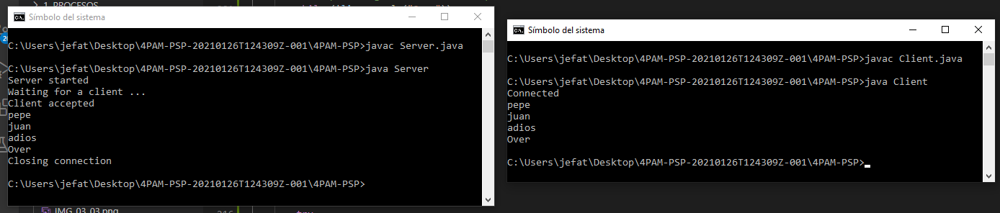
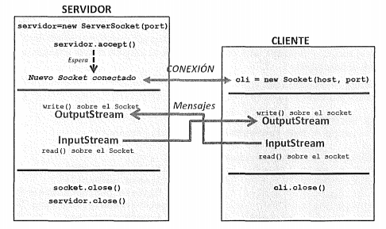

## INTRODUCCIÓN TEÓRICA GENERAL
Los protocolos TCP y UDP utilizan el concepto de *socket* para favorecer un canal de  comunicación fiable entre aplicaciones o procesos. el concepto recuerda mucho a las tuberías o *pipes* vistos en el tema de procesos. 

La comunicación mediante sockets se sustenta en el concepto de transmisión de un mensaje entre un conector de una aplicación y un conector de otra, a este conector es a lo que llamamos *socket*. 

JAVA nos permite un nivel de abstracción mayor o menor dependiendo del nivel en el que nos encotremos dentro de la pila de comunicaciones TCP/IP.


Algunos aspectos a destacar acerca de los sockets son los siguientes:
* Cada socket tiene un número de puerto asociado a él.
* Este puerto identifica el proceso que esta enviando o recibiendo la información a través del socket.
* Cuando un proceso local quiere comunicarse con un proceso remoto, los dos establecen sus propios números de puerto.
* Cada vez que la información se envía entre ellos, la computadora sabe a que proceso debe recibir la información comprobando el puerto de destino.
    
    Ejemplo: Sl host A, tiene un proceso PA escuchando en el puerto 33. Cada vez que el A reciba un mensaje con puerto de destino 33, ese mensaje lo recibirá el proceso PA.

### Comunicación Cliente – Servidor
- Servidor permanece escuchando en un puerto dado, esperando peticiones de un Cliente.
    - Hay puertos estándar para servicios estándar: http, ftp, ssh, dns, ...
    - Cuando recibe una petición la procesa y envía la respuesta.
    - Rol pasivo en la comunicación 
- Cliente, que debe saber la dirección IP y el puerto del Servidor le envía mensajes y espera la respuesta.
    - El puerto del cliente se asigna aleatoriamente (> 1023 que son los estándar).
    - Rol activo en la comunicación
- Cuando un cliente se conecta a un servidor, se establece el socket de comunicación
por el que el cliente manda peticiones al servidor y el servidor envía las respuestas apropiadas al cliente

    Ej: protocolo http (web)
- Una vez establecida la conexión, el servidor sigue escuchando por el mismo puerto a otros clientes que pueden establecer otras conexiones.

### Tipos de Sockets
- **Sockets TCP**: 
    - orientados a la conexión. → se establece una conexión fiable
    - Los mensajes llegan ordenados y sin errores (se confirma la recepción de cada mensaje).
    - Se usan cuando la integridad de los datos enviados es más importante que la velocidad.
    - Más lento que conexiones UDP.

    Ej: FTP → la integridad de los ficheros subidos o descargados es muy importante
- **Sockets UDP**: 
    - No orientado a la conexión → no se establece una conexión fiable.
    - Se pueden perder mensajes y / o llegar desordenados (no se confirma nada)
    - Se usa cuando la velocidad es más importante que la integridad
    - Más rápido que TCP

    Ej: Streaming → es más importante recibir el vídeo rápido que perder un fotograma

## SOCKETS EN JAVA
JAVA proporciona el paquete java.net con las clases **ServerSocket** y **Socket** para trabajar con sockets.
### TCP
Ya hemos visto que el protocolo TCP es un protocolo orientado a ofrecer una conexión fiable, por lo que para establecer una comunicación es necesario especificar una conexión entre un par de sockets. 

El socket del cliente es el que solicita una conexión, y el del servidor queda a la espera para atender las peticiones de los clientes. Una vez que el servidor acepta la conexión entrante, ambos sockets quedan conectados y se pueden utilizar para transmitir datos de manera bidireccional

Clase **ServerSocket** : 
- Implementa el socket en el lado del servidor
- Escucha peticiones de conexión de clientes en un puerto


Clase **Socket**: 
- Implementa el socket en el lado del cliente.
- mantiene la comunicación entre cliente y servidor

El proceso de comunicación se podría resumir de la siguiente manera:


### Sockets TPC → Servidor:
El procedimiento básico es el siguiente:
1. Creación del objeto ServerSocket (se puede especificar el puerto en el constructor). 
2. Asignación de dirección y puerto (.bind). (OPCIONAL)
3. Escucha en el puerto
4. Aceptación de conexiones (.accept). Esta operación implica la creación de un nuevo socket, que se usa para comunicarse con el cliente que se ha conectado.
5. Obtener del socket establecido Input y Output Streams para poder comunicarse con el cliente (.getInputStream .getOutputStream)
6. Envío y recepción de mensajes.(read y write)
7. Cierre de la conexión (close).

El siguiente código crea una aplicación servidor que recibe mensajes de texto mediante un objeto *DataInputStream* y los muestra por pantalla hasta que recibe el mensaje "Over" y cierra la conexión y finaliza el programa.

```JAVA
// A Java program for a Server 
import java.net.*; 
import java.io.*; 

public class Server 
{ 
	//initialize socket and input stream 
	private Socket		 socket = null; 
	private ServerSocket server = null; 
	private DataInputStream in	 = null; 

	// constructor with port 
	public Server(int port) 
	{ 
		// starts server and waits for a connection 
		try
		{ 
			server = new ServerSocket(port); 
			System.out.println("Server started"); 

			System.out.println("Waiting for a client ..."); 

			socket = server.accept(); 
			System.out.println("Client accepted"); 

			// takes input from the client socket 
			in = new DataInputStream( 
				new BufferedInputStream(socket.getInputStream())); 

			String line = ""; 

			// reads message from client until "Over" is sent 
			while (!line.equals("Over")) 
			{ 
				try
				{ 
					line = in.readUTF(); 
					System.out.println(line); 

				} 
				catch(IOException i) 
				{ 
					System.out.println(i); 
				} 
			} 
			System.out.println("Closing connection"); 

			// close connection 
			socket.close(); 
			in.close(); 
		} 
		catch(IOException i) 
		{ 
			System.out.println(i); 
		} 
	} 

	public static void main(String args[]) 
	{ 
		Server server = new Server(5000); 
	} 
} 
```
[DESCARGAR CÓDIGO](CODIGO/Server.java)


### Sockets TCP → Cliente:
En este caso, el procedimiento queda de la siguiente manera:

1. Creación del objeto Socket.Se puede especificar dirección y puerto en el constructor.
2. Conexión del socket (connect).
3. Obtenención del socket estableciendo Input y Output Streams para poder comunicarse con el cliente (.getInputStream .getOutputStream)
4. Envío y recepción de mensajes.
5. Cierre de la conexión (close).

```JAVA
import java.net.*;
import java.io.*; 

public class Client
{
	// inicializamos socket and input-output streams y el bufferedreader
	private Socket socket		 = null;
	private DataInputStream input = null;
    private DataOutputStream out	 = null;
    private BufferedReader br = null;

	// constructor to put ip address and port
	public Client(String address, int port)
	{
        // establish a connection
		try
		{
			socket = new Socket(address, port);
			System.out.println("Connected");

			// definimos una entrada por terminal (teclado)
            input = new DataInputStream(System.in);
            
            br = new BufferedReader(new InputStreamReader(input));

			// sends output to the socket
			out = new DataOutputStream(socket.getOutputStream());
		}
		catch(UnknownHostException u)
		{
			System.out.println(u);
		}
		catch(IOException i)
		{
			System.out.println(i);
		}

		// string to read message from input
		String line = "";

		// keep reading until "Over" is input
		while (!line.equals("Over"))
		{
			try
			{
                line = br.readLine();
				out.writeUTF(line);
			}
			catch(IOException i)
			{
				System.out.println(i);
			}
		}

		// close the connection
		try
		{
			input.close();
			out.close();
			socket.close();
		}
		catch(IOException i)
		{
			System.out.println(i);
		}
	}

	public static void main(String args[])
	{
		Client client = new Client("127.0.0.1", 5000);
	}
}
```
[DESCARGAR CÓDIGO](CODIGO/Client.java)

Si compilamos cada aplicación en un terminal distinto y las ejecutamos al mismo tiempo, podemos ver el resultado:



El funcionamiento de esta aplicación básica, explicada de manera gráfica y relacionándola con las fases del proceso de comunicación explicado anteriormente, quedaría de esta manera:



### Algunos aspectos a tener en cuenta
 
Si hacemos uso de la Clase **InetAddress**, podemos obetner la representación de una dirección IP en Java. Dicha clase dispone de métodos para conectarse a un servidor DNS y resolver un nombre de host.

Me permite conectarme a un servidor por el nombre de dominio y automáticamente obtiene la IP 

Para crear un objeto **InetAddress** usamos alguno de los métodos estáticos mostrados en la tabla siguiente:


