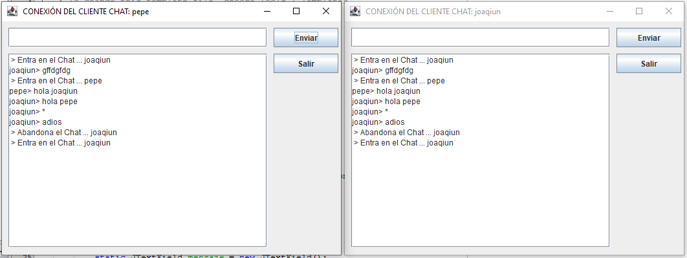

[VOLVER AL ÍNDICE](I.INDICE.md)
-- 

## CHAT TCP
Crear un servidor de chat basico en entorno gráfico uando JAVAFX u otra librería gráfica de JAVA que sea capaz de atender a varios clientes a la vez, cada cliente será atendido en un hilo de ejecución; en ese hilo se recibirán sus mensajes y se enviarán al resto de miembros del chat.

Las especificacione son las siguientes:

El programa servidor define el número máximo de conexiones (10 en este caso) que admite e irá controlando los clientes que actualmente estén conectados, para ello utiliza un objeto de la clase **ComunHilos** que será compartido por todos los hilos. 

Este objeto contiene los siguientes atributos:
* **int CONEXIONES**: Almacena el número de conexiones de clientes. Cada vez que se conecta un cliente sumamos 1 a este atributo y lo usamos como índice para ir llenando el array de sockets con los clientes que se van conectando. El máximo de conexiones permitidas lo indica el atributo MAXIMO.
* **int ACTUALES**: Almacena el número de clientes conectados en este momento. Cada vez que se desconecta un cliente se resta 1 a este atributo.
* **int MAXIMO**: Atributo que indica el número máximo de clientes que se pueden conectar.
* **Socket tabla[]** = new Socket[MAXIMO]: Array que almacena los sockets de los clientes que se conectan. Usaremos el array para tener control de los clientes y así poder enviarles la conversación del chat cada vez que uno envía algún mensaje.
* **String mensajes**: Contiene los mensajes del chat.

En el programa principal del servidor, se recomienda hacer un bucle para controlar el número de  conexiones. Dentro del bucle el servidor espera la conexión del cliente y cuando se conecta se crea un socket. El socket creado se envia al hilo correspondiente, junto con el objeto HilosCumun, se incrementa el número de conexiones y las conexiones actuales y se lanza el hilo para gestionar los mensajes del cliente que se acaba de conectar.

Por otro lado debemos crear la clase que contenga los hilos generados por el servidor. En el método **run()** de dicha clase , se deben enviar los mensajes que hay actualmente en el chat al programa cliente para que los visualice en la pantalla, y a continuación, se recomienda hacer un bucle while para que se reciba todo lo que el cliente escribe en el chat.

Cuando un cliente finaliza (pulsa el botón Salir de su pantalla) envía un asterisco al servidor de chat, entonces se sale del bucle while.

Desde aqui puedes descargar el código común de los hilos:

[HilosComun](CODIGO/HilosComun.java)

