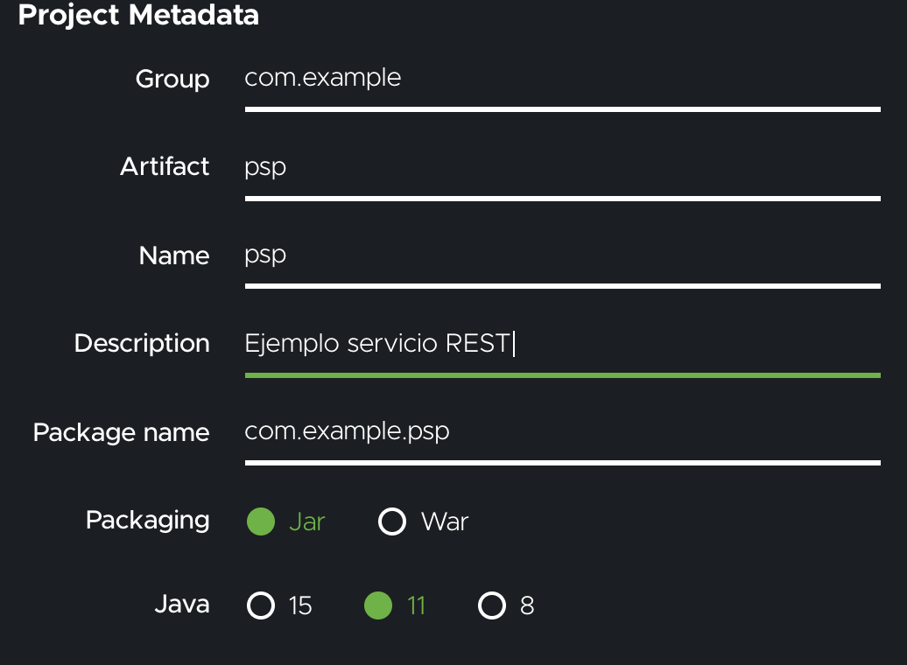
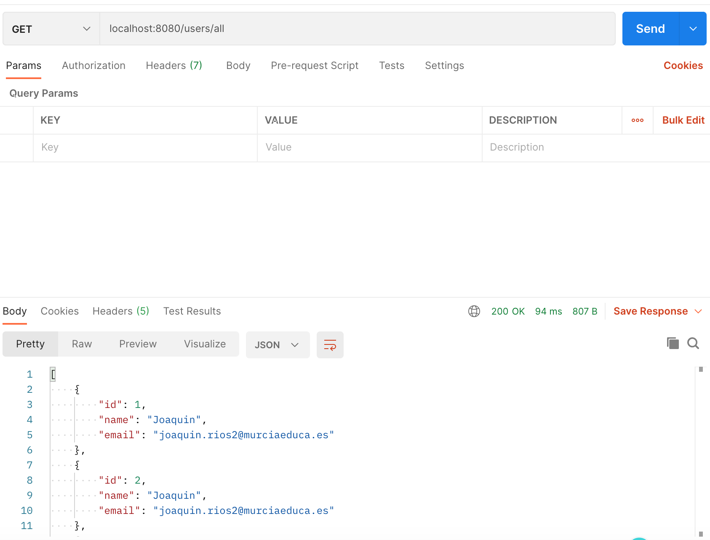

| [INICIO](../README.md) |  [ÍNIDCE UT4](INDICE.md) | UT 4: SERVICIOS DE RED |
| -------------------------------- | :---------------------: | --------------------------: |
# CREANDO UN SERVICIO REST CON SPRING Y MAVEN

Vamos a crear un servidor REST básico que ofrezca datos en formato JSON recibiendo peticiones Http de un cliente. Nuestro servicio se va a construir sobre una base de Spring, con una serie de dependencias necesarias para la creación.

[DESCARGAR CÓDIGO FUENTE](ARCHIVOS/psp4pam.zip)

## 1. CREANDO LA BASE DE DATOS

En primer lugar, vamos a crear una base de datos vacía que nos servirá de base dónde ingresar y extraer datos para nuestra aplicación.

Abra una terminal (símbolo del sistema en Microsoft Windows) y abra un cliente MySQL como usuario que puede crear nuevos usuarios.

Por ejemplo, en un sistema Linux, use el siguiente comando;

```shell
$ sudo mysql --password
```

Una vez conectados al servidor, vamos a crear la base de datos y un usuario asociado:

```shell
mysql> create database db_example;
mysql> create user 'pspuser'@'%' identified by 'P@ssw0rd'; 
mysql> grant all on db_example.* to 'pspuser'@'%'; 
```

Estas tres instrucciones son suficientes de momento.

## 2. CREANDO EL PROYECTO CON SPRING INITIALIZR

Podemos crear proyectos MAVEN desde la mayoría de los IDE que se usan mayoritariamente, pero en este caso, vamos a hacer uso de la herramienta de spring para crear la estructura básica de nuestro proyecto.

Para ello, nos vamos a la web https://start.spring.io/ y configuramos el proyecto según nuestras necesidades.

1. En primer lugar, configuramos las propiedades estructurales del proyecto:

   

Hemos elegido un proyecto MAVEN en Java usando una versión estable de Spring Boot. (En resumen, no hemos tocado nada).

2. A continuación configuramos algunas propiedades del mismo:

   

   Aquí hemos cambiado el nombre a nuestro artifact y el nombre del proyecto, así como la descripción del mismo.

3. Añadimos las dependencias necesarias:

   

   En nuestro caso necesitamos el acceso a la base de datos a través del driver de MySQL, para persistir los datos en la aplicación usaremos Hibernate y Spring Data, y para ofrecer los servicios WEB (servidor Apache Tomcat, MVC , ...) usaremos las dependencias incluidas en Spring Web. 

4. Ahora solo nos falta hacer clic en   y ya tenemos el proyecto en nuestro equipo.

## Crear el archivo `application.properties` 

Spring Boot ofrece por defecto valores predeterminados en todas las cosas. En el caso de la base de datos , la predeterminada es `H2`. Por ello debemos configurar nuestro proyecto para que acceda nuestro servidor MySQL y más concretamente a nuestra base de datos. Para ello debemos crear  un archivo de recursos (resource file) ubicado en  `src/main/resources/` y denominado `application.properties`, con el contenido que se muestra a continuación:

```shell
spring.jpa.hibernate.ddl-auto=update
spring.datasource.url=jdbc:mysql://${MYSQL_HOST:localhost}:3306/db_example
spring.datasource.username=pspuser
spring.datasource.password=P@ssw0rd
```

Es conveniente fijarse en la primera linea, que ofrece la configuración de acceso a la base de datos. El valor de `spring.jpa.hibernate.ddl-auto`puede ser `none`, `update`, `create`, o `create-drop`. Podemos ver la [documentación de Hibernate](https://docs.jboss.org/hibernate/orm/5.4/userguide/html_single/Hibernate_User_Guide.html#configurations-hbmddl) para obtener más detalles, pero aquí mostramos un resumen de que significado tiene cada valor:

- `none`: El predeterminado para `MySQL`. No se realiza ningún cambio en la estructura de la base de datos.
- `update`: Hibernate cambia la base de datos de acuerdo con las estructuras de entidad dadas.
- `create`: Crea la base de datos cada vez, pero no la cierra.
- `create-drop`: Crea la base de datos y la suelta cuando se cierra la `SessionFactory` .

Como nuestra base de datos no tiene contenidos ni estructura, debemos comenzar con `create` o `update`, . Después de la primera ejecución, puede cambiarlo a `update` o `none`, según los requisitos del programa. Usaremos `update` cuando queramos realizar algún cambio en la estructura de la base de datos.

Hemos elegido `update` porque vamos a usar Entities para crear la estructura de nuestra base de datos y realizar una inserción.


## Crear el modelo `@Entity` 

Para modelar los datos de nuestra tabla, vamos a crear un modelo `@Entity` que no servirá para crear la tabla correspondiente en nuestra base de datos. Para más información sobre el modelado de Entities, puedes consultar la [documentación oficial](https://hibernate.org/orm/).

Para nuestro ejemplo vamos a crear un modelo entidad que almacene datos de usuario, en este caso email y nombre, aparte del id.

El archivo quedaría asi

```java
package com.example.psp;

import javax.persistence.Entity;
import javax.persistence.GeneratedValue;
import javax.persistence.GenerationType;
import javax.persistence.Id;

@Entity // This tells Hibernate to make a table out of this class
public class User {
  @Id
  @GeneratedValue(strategy=GenerationType.AUTO)
  private Integer id;

  private String name;

  private String email;

  public Integer getId() {
    return id;
  }

  public void setId(Integer id) {
    this.id = id;
  }

  public String getName() {
    return name;
  }

  public void setName(String name) {
    this.name = name;
  }

  public String getEmail() {
    return email;
  }

  public void setEmail(String email) {
    this.email = email;
  }
}
```

Es una clase muy básica con los atributos necesarios para comunicarse con la base de datos. 

## Crear el repositorio

El siguiente paso es poder realizar la relación real entre este objeto y la base de datos, lo que realizamos con la creación de un repositorio. Los repositorios son interfaces que ofrece Spring para dotar al objeto `Entity` de a funcionalidad necesaria para realizar las operaciones de la base de datos (Lectura, escritura, borrado, ...).

Los dos repositorios mas comunes sobre los que trabajar son **CrudRepository** y **JPARepository** con diferentes funcionalidades. Hemos elegido **CrudRepository** en este caso puesto que ofrece las funcionalidades básicas necesarias para este ejemplo.

Puedes encontrar más información sobre estos dos repositorios en [este enlace](https://www.tutorialspoint.com/difference-between-crudrepository-and-jparepository-in-java).

La implementación se realiza de la siguiente manera.

```java
package com.example.psp;

import org.springframework.data.repository.CrudRepository;

import com.example.accessingdatamysql.User;

// This will be AUTO IMPLEMENTED by Spring into a Bean called userRepository
// CRUD refers Create, Read, Update, Delete

public interface UserRepository extends CrudRepository<User, Integer> {

}
```

Para hacer uso de este repositorio, Spring implementa automáticamente esta interfaz un `bean` que tiene el mismo nombre (desapareciendo la primera mayúscula, por lo que se llama `userRepository`).

## Crear un controlador

Para gestionar las peticiones del cliente, debemos desarrollar un controlador para organizar las peticiones REST y procesarlas. Dicho controlador dispone de un método asociado a cada petición que recibirá, en este ejemplo, mediante GET y POST solicitudes de datos de tipo CRUD (creación, lectura , actualización y borrado de registros) simples.

No vamos a entrar en otro tipo de solicitudes (PATCH, ...) puesto que no disponemos de más tiempo para este tema.

El controlador lleva asociado una serie de anotaciones que vamos a detallar:

```java
@Controller - Indica que esta clase es un controlador de Spring

@RequestMapping(path="/ruta") - Indica que todas las peticiones deben ir por la ruta http://localhost:8080/ruta 

@Autowired - Colocado antes de nuestro repositorio, le dice a Spring que carge el objeto userRepository con los métodos del interfaz correspondiente.
  
@PostMapping(path="/add") - Indica que el método que viene a continuación recibe peticiones POST por la ruta http://localhost:8080/ruta/add

@ResponseBody - Indica que lo que devuelva el método será la respuesta de la petición, puede ser por ejemplo, un String o un JSON.

@RequestParam - Indica que ese argumento del método debe ser enviado en la petición (por GET o POST)

```

Nuestro controlador tendrá el aspecto siguiente:

 ```java
package com.example.psp4pam;

import java.util.Optional;
import org.springframework.beans.factory.annotation.Autowired;
import org.springframework.http.HttpStatus;
import org.springframework.http.ResponseEntity;
import org.springframework.stereotype.Controller;
import org.springframework.web.bind.annotation.GetMapping;
import org.springframework.web.bind.annotation.PatchMapping;
import org.springframework.web.bind.annotation.PathVariable;
import org.springframework.web.bind.annotation.PostMapping;
import org.springframework.web.bind.annotation.PutMapping;
import org.springframework.web.bind.annotation.RequestMapping;
import org.springframework.web.bind.annotation.RequestParam;
import org.springframework.web.bind.annotation.ResponseBody;

/**
 *
 * @author joaquinrios
 */
@Controller
@RequestMapping(path = "/users")
public class MainController {

    @Autowired
    private UserRepository userRepository;

    @PostMapping(path = "/add") 
    public @ResponseBody
    ResponseEntity<User> addNewUser(@RequestParam String name,
            @RequestParam String email) {
        User n = new User();
        n.setName(name);
        n.setEmail(email);
        var usuarioInsertado = userRepository.save(n);
        return new ResponseEntity<>(usuarioInsertado , HttpStatus.OK);
    }

    @GetMapping(path = "/all")
    public @ResponseBody
    Iterable<User> getAllUsers() {
        return userRepository.findAll();
    }

    @GetMapping(path = "/user")
    public @ResponseBody
    ResponseEntity<User> getUserbyID(@RequestParam int id) {
        Optional<User> n = userRepository.findById(id);
        if (n.isPresent()) {
            var pepe =  userRepository.findById(id).get();
            return new ResponseEntity<>(pepe , HttpStatus.OK);
        } else {
            return new ResponseEntity<>(HttpStatus.NOT_FOUND);
        }
    }

    @GetMapping(path = "/user/{id}")
    public @ResponseBody
    ResponseEntity<String> deleteUserbyID(@PathVariable int id) {
        Optional<User> n = userRepository.findById(id);
        if (n.isPresent()) {
            userRepository.deleteById(id);
            return new ResponseEntity<String>("BORRADO", HttpStatus.OK);
        } else {
            return new ResponseEntity<>(HttpStatus.NOT_FOUND);
        }
    }

    @PostMapping(path = "/user/{id}")
    ResponseEntity<User> updateUserbyID(@PathVariable int id, @RequestParam String name,
            @RequestParam String email) {
        Optional<User> n = userRepository.findById(id);
        if (n.isPresent()) {
            User pepe = n.get();
            pepe.setName(name);
            pepe.setEmail(email);
            return new ResponseEntity<>(userRepository.save(pepe), HttpStatus.OK);
        } else {
            return new ResponseEntity<>(HttpStatus.NOT_FOUND);
        }
    }
}
 ```

Podemos explicar más detalladamente cada uno de los métodos/Request aquí creados:

* `getAllUsers` asociado a la ruta "/all", recibe peticiones GET y devuelve un JSON con todos los usuarios de nuestra base de datos.
* `addNewUser` asociado a la ruta "/add", recibe peticiones POST con los datos "name" y "email" a insertar  y devuelve un String "GUARDADO" cuando se ha efectuado el guardado. Este método puede mejorarse comprobando que ninguno de los dos parámetros es vacío y que el correo tiene el formato adecuado.
* `getUserbyID` asociado a la ruta "/user", recibe peticiones GET con el id del usuario y devuelve un JSON con sus datos completos. Si no existe, devuelve una respuesta Http de tipo `HttpStatus.NOT_FOUND`.
* `deleteUserbyID` asociado a la ruta "/user/{id}", recibe peticiones GET con el id del usuario en la ruta y devuelve una respuesta de tipo String confirmando el borrado. Si no existe, devuelve una respuesta Http de tipo `HttpStatus.NOT_FOUND`.
* `deleteUserbyID` asociado a la ruta "/user/{id}", recibe peticiones GET con el id del usuario en la ruta y devuelve una respuesta de tipo String confirmando el borrado. Si no existe, devuelve una respuesta Http de tipo `HttpStatus.NOT_FOUND`.
* `updateUserbyID` asociado a la ruta "/user/{id}", recibe peticiones POST con el id del usuario en la ruta y los datos por POST y actualiza el usuario con el id recibido cono los datos de POST. Devuelve una respuesta de tipo String confirmando el actualizado. Si no existe, devuelve una respuesta Http de tipo `HttpStatus.NOT_FOUND`.

El archivo que contiene la clase `main` no hay que tocarlo, puesto que no vamos a necesitar nada del mismo, mas allá de que ejecute el programa.

## El Resultado

Ahora que el proyecto está terminado, podemos identificar las peticiones y rutas que va a aceptar.

### Peticiones POST
`http://localhost:8080/users/add` 
* **FUNCIÓN**: Inserta un nuevo usuario.
* **RECIBE**: Los datos de usuario.
* **DEVUELVE**: El objeto usuario insertado.

`http://localhost:8080/users/user/5` 
* **FUNCIÓN**: Actualiza los datos del usuario con `id`=5.
* **RECIBE**: Los datos de usuario, sin el id.
* **DEVUELVE**: El objeto usuario modificado si existe, o el código hhtp 404 (NOT FOUND).
* **NOTA**: Aunque alguno no se modifique, hay que mandar todos los datos.


### Peticiones GET
`http://localhost:8080/users/all` 
* **FUNCIÓN**: Lista todos los usuarios.
* **DEVUELVE**: Un JSON con todos los usuarios.

`http://localhost:8080/users/user?id=4` 
* **FUNCIÓN**: Busca el usuario con `id`=4.
* **RECIBE**: El id del usuario a buscar
* **DEVUELVE**: El objeto usuario.

`http://localhost:8080/users/3` 
* **FUNCIÓN**: Borra el usuario con `id`=3.
* **RECIBE**: El id del usuario a buscar
* **DEVUELVE**: El mensaje "BORRADO" si existe, o el mensaje "NO EXISTE" junto con el código hhtp 404 (NOT FOUND) si no existe.

> Junto con la respuesta, también se devuelve el HTTP STATUS que ayude a identificar el tipo de respuesta HTTP del servidor. 
Para más información puedes consultar [este enlace](https://developer.mozilla.org/es/docs/Web/HTTP/Status).


Si todo ha ido bien, podemos ejecutarlo y probar su uso con sentencias de curl o con la herramienta [POSTMAN](https://www.postman.com/).

A continuación mostramos algunos pantallazos de varias pruebas usando ambas formas:

#### CURL
   
   
#### POSTMAN   
   

